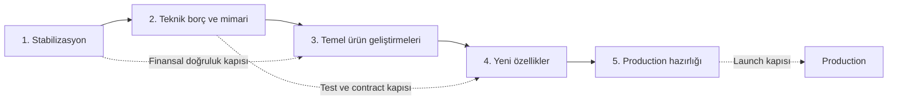

# Önerilen Geliştirme Yol Haritası

> Bu yol haritasının temel ilkesi: yeni özelliklerden önce finansal doğruluk ve atomiklik. Görev kimlikleri [`FIXES_AND_TECH_DEBT.md`](FIXES_AND_TECH_DEBT.md) ile eşleşir. Yeni özellik ayrıntıları [`FEATURE_IDEAS.md`](FEATURE_IDEAS.md) içindedir.

## Yol haritası kapıları

Bir aşama tamamen bitmeden sonraki aşamanın hiçbir işi yapılamaz anlamına gelmez; ancak belirtilen tamamlanma kriterleri aşılmadan kullanıcı verisini veya ürün kapsamını büyüten işler yayınlanmamalıdır.

## Aşama 1 — Stabilizasyon

### Amaç

Yanlış nakit bakiyesi, kısmi commit, PostgreSQL FK hatası, yanlış kur dönüşümü ve güvensiz JWT yapılandırması risklerini ortadan kaldırmak. Bu aşamanın çıktısı “özellik eklenebilir” değil, “mevcut özellikler güvenilir bir muhasebe çekirdeği üzerinde çalışıyor” olmalıdır.

### Başlangıç koşulları

- Mevcut çalışma ağacı değişikliklerinin sahibi tarafından gözden geçirilmesi ve ayrı branch/commit sınırlarının netleştirilmesi.
- Kritik akışların mevcut production/staging veri hacmi ve kullanılıp kullanılmadığının belirlenmesi.
- Database backup/restore prosedürünün en az staging düzeyinde hazır olması.
- Asset silme ve eski `affects_cash` kayıtları için ürün/muhasebe kararının verilmesi.

### Yapılacak görevler

1. **P0.1:** Frontend'deki ikinci cash deposit/withdraw çağrılarını kaldır; `affects_cash` değerini transaction payload'ına koy.
2. **P0.2:** Transaction create/update ile cash account/movement değişikliklerini tek DB transaction'ına al.
3. **P0.3:** Transaction delete'i reverse + delete tek transaction olacak şekilde düzelt; silinmiş FK referansı üretme.
4. **P1.7'nin kritik alt kümesi:** Gerçek PostgreSQL üzerinde cash/transaction integration test fixture'ı kur.
5. **P0.4:** Mevcut veriye yönelik `affects_cash` düzeltici migration'ını staging'de prova et.
6. **P0.5:** Kur eksikliğinde 1:1 fallback'i kaldır; partial/unavailable ve freshness contract'ı ekle.
7. **P0.6:** Production'da default/eksik JWT secret için fail-fast guard ekle.
8. **P1.1:** MVP mixed-currency politikasını uygula; en güvenli kısa yol asset başına tek transaction currency'dir.
9. **P1.3'ün kritik alt kümesi:** DB uzunlukları, currency enum/normalize ve bounded limits.
10. **UX-01 hızlı düzeltme:** Cash hareketlerinde işareti amount değerinden üret ve dashboard kur/hata uyarılarını göster.

### Önerilen uygulama sırası

1. Önce başarısız testleri yaz: UI tek hareket, PostgreSQL delete FK, rollback ve missing FX.
2. P0.1 ile yeni yanlış kayıt üretimini durdur.
3. P0.2 ve P0.3 ile transaction sınırlarını düzelt.
4. Gerçek PostgreSQL testlerini yeşile getir.
5. Staging veri kopyasında P0.4 migration raporu al, mutabakat yap, sonra production planla.
6. P0.5 finansal hesap contract'ını backend ve frontend birlikte değiştir.
7. Config/validation/UX hızlı düzeltmelerini tamamla.

### Tamamlanma kriterleri

- UI'dan BUY/SELL, checkbox açıkken tam bir cash movement; kapalıyken sıfır movement üretir.
- Create/update/delete'in herhangi bir ara adımı hata verdiğinde transaction, movement ve balance birlikte rollback olur.
- PostgreSQL'de FK açıkken kritik cash/transaction testleri geçer.
- Migration öncesi ve sonrası cash balance + movement + transaction mutabakat raporu beklenen fark dışında sıfırdır.
- Kur bulunamayan para birimi dashboard toplamına 1:1 dahil edilmez ve UI açık uyarı gösterir.
- Production ortamı örnek JWT secret ile başlamaz.
- Backend regression testleri ve TypeScript kontrolü geçer; kritik frontend component testleri mevcuttur.

### Riskler

- Eski cash verisinin niyetini koddan kesin çıkarmak mümkün olmayabilir; migration yanlış varsayım yapabilir.
- Atomiklik refactor'u birçok mevcut testin commit beklentisini değiştirebilir.
- Kur fail-closed davranışı dashboard'ı daha sık “kısmi veri” gösterecek hale getirebilir; bu doğruluk için kabul edilmelidir.
- Asset silme davranışı kullanıcı beklentisiyle doğrulanmadan seçilirse veri kaybı algısı oluşabilir.

## Aşama 2 — Teknik borç ve mimari düzenleme

### Amaç

Kritik düzeltmeleri kalıcı kılacak test, API contract, modülerlik, logging ve dokümantasyon altyapısını kurmak. Frontend'in domain iş kuralı üretmesini engelleyen sınırlar netleştirilmelidir.

### Başlangıç koşulları

- Aşama 1 finansal doğruluk kriterlerinin tamamı yeşil.
- Düzeltici migration production/staging politikasının sonuçları belgelenmiş.
- Backend API'nin kırıcı değişiklik gerektiren alanları listelenmiş.

### Yapılacak görevler

1. **P2.1:** Asset/transaction/auth/dashboard/cash ana akışları için frontend Vitest + Testing Library testleri.
2. **P2.2:** Çalışan ESLint ve CI: backend pytest, PostgreSQL integration, frontend lint/test/tsc/build.
3. **P2.3:** Generic API envelopes, backend `response_model`, doğru PUT/PATCH semantiği ve OpenAPI generated TS client.
4. **P2.4:** AssetFormDialog, TransactionDialog, AssetDetailPage ve AssetsPage'i davranış değiştirmeden böl.
5. **P2.7:** Request id, güvenli global 500 handler, structured log ve provider/DB ölçümleri.
6. **P2.6:** README/SPEC/env/endpoint belgelerini gerçek kodla eşitle.
7. **P1.8:** Audit bulgularındaki PostCSS ve React Router sürümlerini kontrollü yükselt.
8. **P3.5:** Boş/gereksiz lockfile'ları kaldır ve Python reproducible dependency stratejisi belirle.
9. SQLite hızlı testleri tutulacaksa foreign key pragma aç; migration testlerini PostgreSQL'e sabitle.

### Önerilen uygulama sırası

1. Frontend test harness + K-01 regression testleri.
2. ESLint ve temel CI workflow.
3. Backend response model/OpenAPI contract; generated client migration'ı küçük servis grupları halinde.
4. Testler koruma sağladıktan sonra büyük UI dosyalarını böl.
5. Logging/metrics ve dependency update.
6. Belgeleri yeni contract'a göre güncelle.

### Tamamlanma kriterleri

- Temiz checkout'ta tek CI hattı backend unit + PostgreSQL integration + migration smoke + frontend lint/test/type/build çalıştırır.
- Frontend test komutu test bulur ve code 0 ile tamamlanır; lint scripti gerçek ESLint binary/config kullanır.
- Frontend domain tiplerinin ana kaynağı OpenAPI/generated client'tır; service cast tekrarları kaldırılmıştır.
- Beklenmeyen 500 yanıtı stack trace/PII içermez; log'daki request id ile izlenebilir.
- En büyük UI dosyaları tek use-case sorumluluğuna ayrılmış ve davranış testleriyle korunmuştur.
- README, SPEC ve env examples kodla tutarlıdır.

### Riskler

- Generated client'a toplu geçiş gereksiz büyük diff oluşturabilir; endpoint grubu başına ilerlenmelidir.
- UI refactor'u görsel regression yaratabilir; screenshot/interaction testleri gerekir.
- Dependency major update'leri router davranışını değiştirebilir; audit düzeltmesi ayrı PR olmalıdır.
- CI süresi PostgreSQL container ile uzayabilir; hızlı unit ve daha az ama kritik integration katmanı ayrılmalıdır.

## Aşama 3 — Temel ürün geliştirmeleri

### Amaç

Specification'da vaat edilen fakat eksik kalan kullanıcı akışlarını tamamlamak ve mevcut verinin doğruluğunu kullanıcıya görünür kılmak.

### Başlangıç koşulları

- Aşama 2 CI ve API contract kapıları çalışıyor.
- Finansal hesaplar kur kaynağı/freshness metadata'sı taşıyor.
- Auth session modelinin kapsamı kararlaştırılmış.

### Yapılacak görevler

1. **Settings:** Display name, baz para birimi, parola değiştirme; validation ve step-up auth.
2. **P1.4:** Refresh session/revocation, logout invalidation ve aktif cihazlar için backend temeli.
3. **P1.6:** Son N timeline düzeltmesi ve idempotent otomatik günlük snapshot job'u.
4. **P1.2:** Asset archive/delete semantiğini UI ile birlikte tamamla.
5. **FEATURE 4:** Rehberli onboarding ve veri kalite merkezi.
6. **FEATURE 5:** Mobil quick-add ve responsive ana akış.
7. Dashboard asset-type filter; tutarlı loading/empty/error/partial-data states.
8. 404 route, React error boundary ve light/dark/system tema seçimi.
9. Accessibility: keyboard sort/actions, associated labels, aria-live toast/error, reduced motion.

### Önerilen uygulama sırası

1. Settings + auth session temelini birlikte tamamla.
2. Timeline query ve günlük job.
3. Veri kalite endpoint'i; sonra onboarding UI.
4. Asset delete/archive UX.
5. Mobile layout ve quick-add.
6. Tema/404/error boundary/accessibility polish.

### Tamamlanma kriterleri

- Settings ekranındaki tüm görünen kontroller çalışır ve backend tarafından doğrulanır.
- Logout/revoke sonrası eski refresh token kullanılamaz.
- Kullanıcı işlem yapmasa bile günlük snapshot oluşur; job aynı gün duplicate üretmez.
- UI eksik fiyat, bayat kur, mixed currency ve provider hatasını normal veriden ayırır.
- 320px–desktop aralığında ana akışlar kullanılabilir; keyboard-only smoke test geçer.
- Bilinmeyen URL ve render exception anlamlı recovery ekranı gösterir.

### Riskler

- Baz para birimi değişimi geçmiş snapshot/performance semantiğini etkiler; snapshot'ların hangi para biriminde immutable olduğu açık kalmalıdır.
- Otomatik job timezone ve daylight-saving farklarında duplicate/kaçırılmış run üretebilir.
- Mobile redesign masaüstü yoğun veri tablolarını gereğinden fazla basitleştirebilir; iki görünüm aynı veriyi kullanmalıdır.

## Aşama 4 — Yeni özellikler

### Amaç

Güvenilir temel üzerine kullanıcı başına değeri ve retention'ı artıran özellikleri kademeli eklemek. İlk özellikler veri giriş maliyetini azaltmalı; AI, veri ve değerlendirme altyapısından sonra gelmelidir.

### Başlangıç koşulları

- Aşama 3 ana kullanıcı akışları tamamlanmış.
- Otomatik snapshot en az birkaç sürüm boyunca güvenilir çalışmış.
- Product analytics/feedback ile en büyük kullanıcı problemi doğrulanmış.
- AI veya e-posta sağlayıcılarına veri gönderimi için privacy/retention kararı verilmiş.

### Yapılacak görevler

Önerilen ürün sırası:

1. **FEATURE 1 — CSV import MVP:** Bir yaygın format + manuel kolon eşleme + dry-run + duplicate koruması.
2. **FEATURE 7 — Uyarılar MVP:** Stale price ve kullanıcı tanımlı fiyat eşiği; önce in-app.
3. **FEATURE 2 — Hedefler:** Tek baz para, basit katkı projeksiyonu.
4. **FEATURE 3 — Performance analytics:** TWR/XIRR ve benchmark; snapshot/ledger doğruluğu kanıtlandıktan sonra.
5. **FEATURE 6 — Otomasyon:** Recurring draft deposit/transaction; otomatik yazım default kapalı.
6. **FEATURE 8 — AI özet:** Read-only, deterministik metrikleri açıklayan ve kaynak gösteren asistan.
7. **FEATURE 9 — AI import mapping:** Deterministik import ve evaluation set'i oluştuktan sonra.
8. Kullanıcı/operasyon ihtiyacına göre admin provider health ve premium paket deneyleri.

Her özellik için zorunlu mini süreç:

1. Problem ve başarı metriğini tanımla.
2. Threat/privacy model çıkar.
3. API/DB migration tasarımını review et.
4. Feature flag arkasında küçük kullanıcı grubuna aç.
5. Veri doğruluğu, latency, hata oranı ve kullanım metriğini izle.
6. Geri alma/disable yolunu doğrula.

### Tamamlanma kriterleri

- CSV import aynı dosyayı iki kez finansal olarak çoğaltmaz; kullanıcı commit öncesi tam önizleme görür.
- Uyarılar cooldown/dedup uygular ve yanlış fiyatı “gerçek alarm” olarak yaymaz.
- Hedef/performance hesapları metodoloji ve para birimi kaynağını gösterir.
- AI çıktıları her sayısal iddiayı uygulamanın deterministik verisine bağlar; model finansal yazım yapamaz.
- Her özellik feature flag, telemetry ve geri alma mekanizmasına sahiptir.

### Riskler

- Import parser hatası toplu yanlış kayıt yaratabilir; dry-run ve idempotency zorunludur.
- Alarm yorgunluğu retention'ı düşürebilir; default kurallar sınırlı olmalıdır.
- Performance metodolojisi yanlış anlaşılabilir; TWR/XIRR açıklamaları gerekir.
- AI halüsinasyonu finansal güveni zedeler; hesap modelden değil backend'den gelmelidir.
- Premium plan erken eklenirse çekirdek ürün doğruluğundan odağı dağıtır.

## Aşama 5 — Production hazırlığı

### Amaç

Uygulamayı güvenli, gözlemlenebilir, yedeklenebilir ve kontrollü biçimde deploy edilebilir hale getirmek. Aşama 1'de başlayan güvenlik kontrolleri burada operasyonel launch gate'e dönüşür.

### Başlangıç koşulları

- Önceki aşamaların CI, migration ve finansal doğruluk kapıları yeşil.
- Hedef trafik, kullanıcı sayısı, veri retention ve RPO/RTO tanımlanmış.
- Deployment ortamı ve sorumluluk sahibi belirlenmiş.

### Yapılacak görevler

#### Security

- MFA veya en az session/device revoke; step-up auth.
- Secret manager, key rotation, HTTPS-only secure cookie, HSTS ve trusted proxy ayarı.
- Auth/public price endpoint rate limits, abuse detection ve security headers.
- Dependency/SBOM/container scan ve düzenli update süreci.
- PII/financial data classification, log redaction ve retention policy.
- Admin işlemleri için RBAC ve immutable audit.

#### Deployment

- Backend'i reload olmadan production worker modeliyle çalıştır.
- Frontend'i multi-stage build ile statik asset olarak CDN/Nginx/hosting üzerinden servis et.
- Development bind mount'larını production compose/manifest'ten çıkar.
- DB'yi public host portundan kaldır; managed/private network kullan.
- Container'ları non-root; read-only filesystem mümkünse; healthcheck/restart/resource limits.
- Blue/green veya rolling deploy ve backward-compatible migration politikası.

#### Database ve backup

- Otomatik encrypted backup, point-in-time recovery ve düzenli restore drill.
- Migration preflight, backup gate ve rollback/roll-forward runbook.
- Connection pool, statement timeout, slow query ve index monitoring.
- Cash/transaction mutabakat job'u: balance = movement sum invariant kontrolü.

#### Observability ve operasyon

- Structured logs, error tracking, traces ve service/provider dashboards.
- SLO'lar: auth başarı/latency, dashboard latency, price freshness, job success.
- Alarm kuralları ve incident response runbook.
- Provider quota/circuit breaker ve fallback durumu dashboard'u.
- Synthetic login/dashboard smoke ve uptime check.

#### Ölçeklenebilirlik

- **FEATURE 12/P3.1-P3.2:** Background price pipeline, ortak HTTP session, bounded concurrency, shared cache/locks.
- Pagination/cursor ve uzun tablo virtualization.
- Load test: tipik, yüksek portföy ve provider outage senaryoları.

### Önerilen uygulama sırası

1. Production threat model + data classification + SLO/RPO/RTO.
2. Production image/hosting ve secret/TLS/session security.
3. Backup/restore ve migration runbook.
4. Logging/metrics/tracing ve provider health.
5. Shared cache/background worker/pagination yalnız ölçüm gerektiriyorsa.
6. Load/security/restore testleri.
7. Sınırlı beta → gözlem → genel erişim.

### Tamamlanma kriterleri

- Production image'da reload/dev server/bind mount/default credential yoktur.
- HTTPS dışında auth cookie kabul edilmez; default secret ile startup mümkün değildir.
- Backup'tan yeni ortama restore tatbikatı belirlenen RPO/RTO içinde başarıyla tamamlanmıştır.
- Clean database'e forward migration ve bir önceki uygulama sürümüyle uyumlu rollout planı doğrulanmıştır.
- Cash ledger invariant ve critical financial smoke test deploy sonrası otomatik çalışır.
- SLO dashboard ve kritik alarmlar çalışır; runbook'ta sorumlu ve ilk müdahale adımları vardır.
- Dependency/container taramasında kabul kriterini aşan açık risk yoktur veya belgeli istisna vardır.
- Load test hedef trafikte dashboard ve write endpoint'lerinin kabul edilen latency/error sınırlarını karşılar.

### Riskler

- Production hardening'i son aşamaya bırakmak, önceki aşamalarda gerçek kullanıcı verisiyle erken yayın riskini artırır. Bu nedenle secret, atomiklik, session ve backup gibi launch-blocker maddeler daha önce de uygulanmalıdır.
- Worker/cache eklemek operasyonel karmaşıklık yaratır; ölçüm göstermeden Redis/queue zorunlu tutulmamalıdır.
- Migration rollback her veri dönüşümünde gerçekçi değildir; çoğu durumda roll-forward + backup restore daha güvenlidir.
- Provider bağımlılığı tam giderilemez; kullanıcıya freshness ve partial-data durumu dürüstçe gösterilmelidir.

## İlk önerilen geliştirme aşaması

İlk sprint/çalışma paketi yalnız şu zincire odaklanmalıdır:

1. K-01 için failing frontend/integration test.
2. Frontend manual cash çağrılarını kaldırma ve `affects_cash` payload'ı.
3. Transaction/cash unit-of-work refactor'u.
4. PostgreSQL'de transaction delete FK testi ve düzeltmesi.
5. Eski veri için migration envanter/dry-run planı.
6. Missing-FX fail-closed contract testi ve uygulaması.

Bu paket tamamlanmadan yeni dashboard, AI veya import özelliğine başlanmamalıdır.
