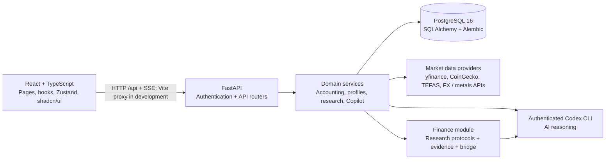

<div align="center">

# PortfolioMind

**A personal finance workspace for portfolio tracking, investment research, and AI-assisted record keeping.**


[Capabilities](#capabilities) · [Architecture](#architecture) · [Run locally](#run-locally) · [Engineering & validation](#engineering--validation) · [Development direction](#development-direction)

</div>

## Overview

Managing personal finances often means switching between brokerage accounts, spreadsheets, price feeds, research notes, and debt statements. PortfolioMind brings those records into one workspace so users can understand what they own, how their finances are changing, and which investment questions deserve attention.

The application combines a multi-asset tracker with cash and liability management, investment research, financial goals, and a conversational Copilot. It connects financial records with the context behind them: holdings, cost basis, investment theses, decisions, and the intended use of capital.

Originally built as **NetWorth**, the project is evolving into PortfolioMind. Some package names, API metadata, and database identifiers still use the original name. The interface currently combines English and Turkish, with support for Turkish markets and locale-aware financial formatting.

> [!NOTE]
> **Active development.** This README describes the current source implementation, not a production-readiness certification. External prices and AI workflows depend on provider availability and configuration. PortfolioMind records financial activity internally; it does not place orders with brokers or exchanges.

## Capabilities

### Portfolio and personal finances

- **Multi-asset holdings:** BIST and international stocks, forex, precious metals, crypto, Turkish investment funds, real estate, and custom assets.
- **Transaction records:** Buy/sell history, position quantities, cost-basis calculations, and realized/unrealized profit and loss where the underlying data supports them.
- **Portfolio dashboards:** Allocation charts, recorded historical snapshots, holding performance, monitoring views, and TRY/USD presentation.
- **Cash and liabilities:** Cash accounts, deposits, withdrawals, transfers, debt records, and net-worth summaries.
- **Credit-card records:** Manually maintained statements, statement transactions, installment plans, confirmation flows, and installment forecasts.
- **Market data:** Provider-based price refreshes, caching, price history, and last-known-price fallback when available. These are fetched quotes rather than an exchange streaming feed.

### Research and Copilot

- **Research workspace:** Watchlists, discovery candidates, research stages, instrument-level intelligence, review history, and technical plans.
- **Briefings and decision history:** Portfolio developments, formal research reviews, and a decision journal. An optional application scheduler supports daily briefings and is disabled by default.
- **Conversational Copilot:** Portfolio-aware conversations, streamed responses through Server-Sent Events, external research tools, and deterministic portfolio scenario calculations.
- **Reviewed record changes:** Supported transaction records, watchlist changes, and decision notes can be proposed through Copilot and applied through separate confirmation endpoints.
- **Portfolio onboarding:** CSV and natural-language import flows with reconciliation, preview, and explicit confirmation. Opening positions are stored separately from historical transactions.

### Financial context

- **Investor profile:** Questionnaire-based assessment, editable drafts, confirmed profiles, and version history.
- **Goals and mandates:** Financial goals, investment mandates, and assignments of existing holdings or cash to a purpose.
- **Financial profile:** Income and essential-spending context, planning currency, derived financial summaries, and goal progress. The broader personalization design remains more extensive than the current implementation.

### Implementation boundaries

| Area | Present in the codebase | Remaining work or dependency |
| --- | --- | --- |
| Portfolio, cash, liabilities, dashboards | API, persistence, UI, and tests | Continued accounting and UX refinement; external prices require available providers |
| Credit-card statements | Manual statement/installment workflows and PDF size, signature, and duplicate checks | PDF transaction extraction and automatic categorization are not implemented; preflight reports `analysis_available=false` |
| Research and briefings | Research UI, discovery services, review records, Finance bridge, optional scheduler | Live evidence and AI review execution require their providers and configuration |
| Copilot | Codex CLI adapters, conversations, SSE, research/simulation tools, supported action proposals | Authentication is required; action support differs between the original and V2 flows |
| Portfolio import | CSV/text parsing, reconciliation, opening positions, confirmation and audit flow | Screenshot upload validates the image, then returns HTTP `501` because extraction is not connected |
| Profiles, goals, mandates | Models, migrations, services, UI, and tests | Broader adaptive policy and personalization behavior is still evolving |
| Gemini / LangChain | Referenced in early specifications | Not used by the current backend AI execution path; adapters use Codex CLI |
| General income/expense ledger | Income and spending expectations can be entered as financial context | Dedicated transaction-based income/expense tracking remains planned |
| Brokerage connectivity | Internal holdings and transaction records | No broker account synchronization or live trade execution integration |

## Architecture

The local development environment runs the React client, FastAPI application, and PostgreSQL database in Docker Compose. The backend also mounts the repository's `Finance/` module, which supplies investment research protocols, providers, and bridge code.



### Design choices

**Separate an investment from its owner's position.** An `Instrument` represents the canonical security identity; an `Asset` represents a user-owned holding. Research attaches to instruments, while transactions and opening positions describe the user's financial records.

**Keep accounting in domain services.** FastAPI routers validate requests and delegate to async services. Financial amounts are persisted as `Numeric(18,6)`, while accounting calculations use Python `Decimal`. Pydantic schemas define API contracts.

**Preserve incomplete history.** An imported holding creates an `OpeningPosition` rather than an invented purchase or cash outflow. Unknown cost basis is represented explicitly, and unsupported profit/loss values can remain unavailable.

**Separate AI reasoning from financial writes.** The Copilot V2 tool registry restricts conversational tools to reads and proposals. Its separate confirmation path uses typed contracts, ownership checks, row locking, current-state validation, repeat-execution protection, and audit logs. Formal research reviews use separate orchestration that can update instrument intelligence.

**Assign purpose without duplicating wealth.** Goals and mandates reference existing financial resources through capital assignments. Assignments organize capital; they do not create additional holdings or cash balances. Financial context and investor preferences remain separate from actual financial records.

### Technology stack

| Layer | Technologies |
| --- | --- |
| Client | React 18, TypeScript strict mode, Vite 5, React Router 6, Zustand |
| UI and visualization | Tailwind CSS, shadcn/ui with Radix primitives, Recharts, Lucide, Framer Motion |
| Forms and validation | React Hook Form, Zod, Pydantic 2 |
| API and services | Python 3.12, FastAPI, async SQLAlchemy 2, asyncpg, HTTPX, aiohttp |
| Persistence | PostgreSQL 16, Alembic migrations |
| Authentication | HS256 JWT access tokens, rotating refresh sessions, bcrypt, httpOnly cookies, SlowAPI |
| AI and research | Containerized Codex CLI, SSE, local `investment_intelligence` module |
| Testing and delivery | pytest, pytest-asyncio, Vitest, React Testing Library, Docker Compose, GitHub Actions |

### Market data adapters

| Data | Implemented source | Operational detail |
| --- | --- | --- |
| Stocks | yfinance | BIST and international ticker handling; availability varies by symbol |
| Crypto | CoinGecko | Public price endpoint and local ticker-to-provider mappings |
| Forex | ExchangeRate-API | Requires `EXCHANGE_RATE_API_KEY` |
| Precious metals | yfinance futures; optional MetalPriceAPI / gold FX fallback | Futures-based estimates and weight conversions; not retail dealer quotes |
| Turkish funds | TEFAS | Fund directory, unit prices, and bounded historical data |
| Real estate / custom assets | Manual values | User-maintained valuation |

The quote service uses a five-minute in-memory cache and can return the latest stored price after a provider failure. Price responses identify the source and fetch time; successful external calls are not guaranteed.

## Run locally

**Prerequisites:** Docker Engine or Docker Desktop with Docker Compose. Container images provide the Python and Node.js runtimes.

From the repository root, create the backend configuration:

```bash
cp backend/.env.example backend/.env
```

On PowerShell, use `Copy-Item backend/.env.example backend/.env` instead. If the file already exists, edit it rather than replacing it.

Initialize private credentials with `backend/scripts/bootstrap_local_secrets.py` on a first-time setup; it writes the ignored root `.env` without displaying secrets or overwriting an existing file. Add provider keys to `backend/.env` only for the integrations you want to use. See [runtime credential configuration](docs/runtime-security.md) for startup and rotation with an existing database.

Start the core local services:

```bash
docker run --rm -v "${PWD}:/workspace" -w /workspace python:3.12-slim python backend/scripts/bootstrap_local_secrets.py
docker compose up -d --build db backend frontend
docker compose ps
```

The backend startup command runs `alembic upgrade head` before launching Uvicorn. Source directories are mounted for development reloads.

| Service | Local address |
| --- | --- |
| Application | [localhost:5173](http://localhost:5173) |
| Interactive API documentation | [localhost:8000/docs](http://localhost:8000/docs) |
| OpenAPI schema | [localhost:8000/openapi.json](http://localhost:8000/openapi.json) |
| Health endpoint | [localhost:8000/api/health](http://localhost:8000/api/health) |

Register an account through the application. Core record keeping does not require Codex authentication.

> [!IMPORTANT]
> The Compose file also includes an Nginx proxy and a Cloudflare Quick Tunnel. The command above selects the local application services; running the entire Compose file also starts the tunnel. This is a development configuration with local defaults, not a production deployment template.

### Enable AI workflows

The backend image includes Codex CLI. Authenticate it using device authorization:

```bash
docker compose run --rm --no-deps backend codex login --device-auth
docker compose run --rm --no-deps backend codex login status
```

The `codex_data` volume preserves the login between container lifecycles. AI workflows also require network access and applicable provider configuration; CLI installation alone does not enable them.

### Useful commands

```bash
# Inspect application logs
docker compose logs -f backend frontend

# Apply migrations after schema changes
docker compose exec -T backend alembic upgrade head

# Stop the stack, keeping named volumes
docker compose down
```

### Configuration reference

| Variable | Purpose |
| --- | --- |
| `SECRET_KEY` | Required, independently generated JWT signing secret |
| `ENVIRONMENT`, `COOKIE_SECURE` | Environment validation and secure-cookie behavior |
| `DATABASE_URL` | Async PostgreSQL connection; supplied by Compose for local containers |
| `FRONTEND_ORIGIN` | Allowed CORS origin |
| `EXCHANGE_RATE_API_KEY`, `METAL_PRICE_API_KEY` | Optional server-side market data credentials |
| `INTEGRATION_TOKEN` / `PORTFOLIOMIND_API_TOKEN` | Scoped Finance bridge credential; requires an explicit existing user UUID |
| `CODEX_DEFAULT_TIMEOUT_SECONDS`, `CODEX_DEEP_RESEARCH_TIMEOUT_SECONDS` | AI execution time limits |
| `BRIEFING_SCHEDULER_ENABLED`, `BRIEFING_SCHEDULE_*` | Optional briefing schedule and timezone |
| `STATEMENT_PDF_MAX_BYTES` | Statement PDF preflight size limit |

See [the backend environment template](backend/.env.example) and [settings definitions](backend/app/config.py). The frontend calls relative `/api` routes through the Vite development proxy; its server-side target is configured with `BACKEND_URL`.

## Engineering & validation

Backend tests cover authentication, ownership boundaries, portfolio accounting, cash and liabilities, statements, research, Copilot proposals/imports, and financial profiles. Frontend tests cover service behavior, page interactions, import/proposal cards, and financial displays.

Run the application suites and frontend build inside the canonical containers:

```bash
docker compose exec -T backend pytest -q
docker compose exec -T frontend npm run test:run
docker compose exec -T frontend npm run build
```

Backend tests use isolated in-memory SQLite by default and support `TEST_DATABASE_URL` for PostgreSQL runs. PostgreSQL test setup creates and drops application tables, so that variable must point to a disposable test database.
Tests that require currency conversion explicitly opt into the `forex_provider` fixture, which supplies documented synthetic rates at the provider boundary. Other tests treat live forex as unavailable; unsupported pairs remain unavailable, and missing-rate/error-path tests stay active. Production calculations never substitute a default cross-currency rate.

TEFAS tests exercise HTTP payloads and quote parsing through an injected `httpx.MockTransport`, including invalid and zero-price responses. News tests freeze their clock so the freshness filter remains tested without fixtures aging out. Optional live TEFAS availability can be checked separately with `docker compose exec -T backend python scripts/check_tefas_live.py`; this probe reports unavailable/invalid quotes and exits nonzero instead of fabricating a price.

The checked-in [GitHub Actions workflow](.github/workflows/postgresql-migrations.yml) checks for a single Alembic head, applies migrations to clean PostgreSQL, verifies the schema, exercises a migration downgrade/re-upgrade, and runs backend tests. Frontend tests/build are not currently part of that workflow. This README does not assert a passing CI run or a coverage percentage.

Useful implementation entry points:

| Concern | Source |
| --- | --- |
| App composition | [FastAPI entry point](backend/app/main.py), [React routes](frontend/src/App.tsx) |
| Financial calculations | [Portfolio statistics](backend/app/services/portfolio_stats.py), [financial intelligence](backend/app/services/financial_context/intelligence_service.py) |
| Copilot boundaries | [V2 orchestration](backend/app/services/copilot_v2/orchestrator.py), [tool registry](backend/app/services/copilot_v2/tools/registry.py), [action executor](backend/app/services/copilot_v2/action_executor.py) |
| Import and reconciliation | [Import service](backend/app/services/copilot/import_service.py), [opening-position model](backend/app/models/opening_position.py) |
| Research integration | [Formal review service](backend/app/services/formal_review.py), [instrument intelligence](backend/app/services/intelligence.py) |
| Database evolution | [Alembic revisions](backend/alembic/versions), [schema verification](backend/scripts/check_migration_schema.py) |

## Repository layout

```text
PortfolioMind/
├── backend/
│   ├── app/
│   │   ├── models/             # Financial records, instruments, research, profiles
│   │   ├── routers/            # HTTP and streaming endpoints
│   │   ├── schemas/            # Pydantic contracts
│   │   ├── services/           # Async domain logic and Copilot orchestration
│   │   ├── providers/          # Fund data adapter
│   │   └── utils/              # Prices, caching, currency conversion
│   ├── alembic/                # Schema migrations
│   ├── scripts/                # Verification utilities
│   └── tests/                  # Backend tests
├── frontend/
│   └── src/
│       ├── components/         # UI primitives and domain components
│       ├── pages/              # Routed screens
│       ├── hooks/              # Data-fetching hooks
│       ├── services/           # API clients and session handling
│       ├── store/              # Zustand state
│       └── types/              # Frontend contracts
├── Finance/
│   ├── src/                    # Investment Intelligence package
│   └── system/                 # Research protocols and architecture
├── docs/                       # Specifications and design proposals
├── .github/workflows/          # Migration and backend test workflow
└── docker-compose.yml          # Local runtime and additional tunnel services
```

## Development direction

The project has grown from portfolio CRUD into a connected financial workspace. Ongoing work refines the research, Copilot, import, and financial-context flows. Remaining areas include:

- Connecting a real screenshot extraction provider to the validated import pipeline.
- Extending PDF preflight into reviewable statement extraction and categorization.
- Developing the broader goal-aware policy and adaptive personalization design.
- Adding a dedicated income/expense ledger beyond financial-context estimates.
- Expanding automated frontend validation and preparing configuration for deployment beyond local development.

The original [Phase 1 specification](SPEC.md) provides historical context. Documents under `docs/` include implemented specifications and design proposals; their stated scope and current code should be checked together.

## Privacy and licensing

Keep credentials in ignored environment files and treat Codex authentication data as private. Use fictional accounts and financial records for public demonstrations. Before publishing, review tracked research/context documents and development configuration for private information; this README is not a repository-wide publication audit.

A project-level license has not been added. No open-source license is asserted here.