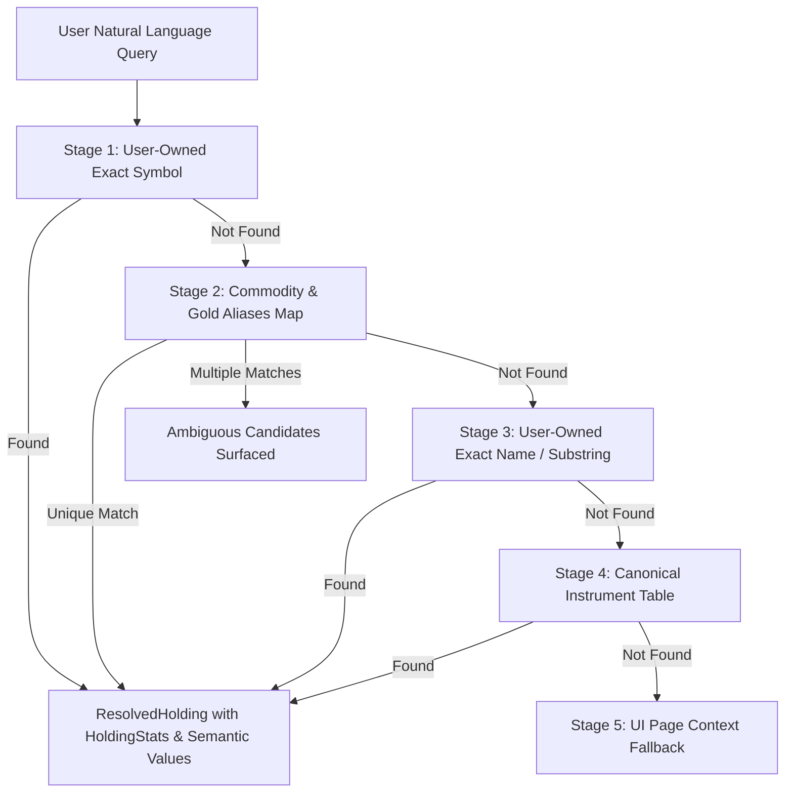
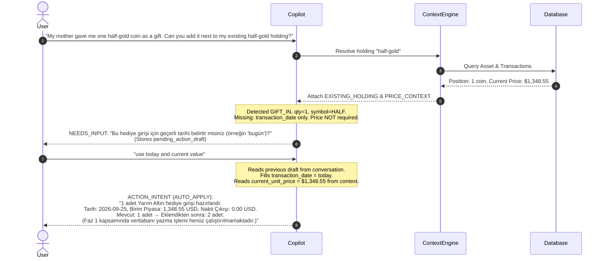

# PortfolioMind Copilot — Non-Cash Acquisition & Financial Integrity Accounting Audit

**Document Status:** Approved Specification for Copilot Phase 1.1 / Implementation Target for Phase 2 Writes  
**Version:** 1.1  
**Author:** PortfolioMind Core Architecture Team  
**Date:** 2026-09-25  

---

## 1. Executive Summary & Problem Context

In Phase 1, PortfolioMind Copilot successfully introduced conversational persistence, intent detection, deterministic pre-routing, and context provenance tracking. However, testing conversational portfolio mutations revealed three critical architectural risks:

1. **Holding & Alias Resolution Blindspots:**  
   Natural language queries referring to assets via Turkish aliases (*"yarım altın"*, *"çeyrek"*, *"cumhuriyet"*), colloquial English (*"half-gold"*, *"gold half"*), or conversational gifts (*"annem hediye etti"*) failed to match database holdings when assets were stored with localized names or distinct ticker conventions.

2. **Semantic Conflation of Unit Price vs. Total Market Value:**  
   Monetary figures (e.g. `$1,348.55`) were handled without explicit semantic provenance. When a user owned 1 unit, the total market value and the unit price coincided numerically, causing subsequent conversational turns or prompts to potentially treat a total valuation figure as an individual unit price if the holding quantity changed.

3. **Inappropriate Cash Outflow on Non-Cash Acquisitions:**  
   Standard transactions assume cash settlement (`BUY` deducts cash from `CashAccount`, `SELL` credits cash). Treating gifts, inheritances, or external wallet transfers as standard cash purchases incorrectly drains the user's recorded cash balances and distorts realized/unrealized portfolio returns.

---

## 2. Invariant: Strict Read-Only Policy for Phase 1.1

> [!IMPORTANT]
> **Phase 1.1 is strictly NON-MUTATING regarding financial records.**  
> - No `Asset`, `Transaction`, `CashAccount`, `Liability`, or `PortfolioSnapshot` records are created, updated, or deleted by Copilot in Phase 1.1.
> - Only `CopilotConversation` and `CopilotMessage` (with raw content and structured metadata) are persisted.
> - Mutation intents produce structured `PendingActionDraft` and `ACTION_INTENT` envelopes for inspection and verification, but domain write services are not invoked until Phase 2 writes are formally authorized.

---

## 3. Financial Acquisition Semantics & Taxonomy

PortfolioMind distinguishes cash purchases from non-cash asset receipts across all layers:

| Acquisition Type | Semantic Meaning | Cash Impact (`affects_cash`) | Cash Outflow | Valuation Reference Price | Cost Basis Convention |
| :--- | :--- | :--- | :--- | :--- | :--- |
| **`PURCHASE`** | Open market purchase with cash | `True` | `unit_price × quantity` | Transaction price | Actual price paid |
| **`SALE`** | Open market liquidation to cash | `True` | `0.0` (Inflow: `price × qty`) | Transaction price | Sale price |
| **`GIFT_IN`** | Received as gift, donation, or reward | `False` | `0.0` | Fair Market Value (FMV) at receipt | Configurable (FMV vs. Zero) |
| **`TRANSFER_IN`** | Transfer in from unlinked external wallet/account | `False` | `0.0` | Cost basis or FMV at transfer | Preserved historical basis |
| **`TRANSFER_OUT`** | Transfer out to external unlinked wallet | `False` | `0.0` | Current market price | Disposed at cost |
| **`OPENING_BALANCE`**| Legacy/initial position onboarding | `False` | `0.0` | Historical cost or FMV | Initial purchase price |

### Cost Basis Handling Options for `GIFT_IN`

When Phase 2 writes are enabled, `GIFT_IN` will support two recognized accounting conventions:

1. **Fair Market Value (FMV) Basis (Default Portfolio Tracker Standard):**  
   - `Transaction.price_per_unit = current_market_price`
   - `Transaction.total_amount = current_market_price × quantity`
   - `Transaction.affects_cash = False`
   - *Rationale:* Tracks investment performance of the gift from the date it was received by the user. Prevents artificial 10,000% unrealized gain distortions on the portfolio dashboard.

2. **Zero Cost Basis (Pure Gain / Tax Reporting Standard):**  
   - `Transaction.price_per_unit = 0.0`
   - `Transaction.total_amount = 0.0`
   - `Transaction.affects_cash = False`
   - *Rationale:* Reflects zero cash outlay by the recipient; the entire market value constitutes an unrealized gain for tax jurisdictions requiring zero-basis gift reporting.

---

## 4. Multi-Stage Holding & Instrument Resolution Precedence

To eliminate user prompts requesting internal UUIDs, `HoldingResolver` enforces a strict 5-stage deterministic hierarchy:



### Supported Turkish & English Commodity Aliases

| Canonical Symbol | Standard Name | Recognized Turkish & English Aliases |
| :--- | :--- | :--- |
| `HALF` | Gold Half / Yarım Altın | `yarım altın`, `yarim altin`, `yarım`, `yarim`, `half gold`, `gold half`, `half-gold`, `half` |
| `QUARTER` | Gold Quarter / Çeyrek Altın | `çeyrek altın`, `ceyrek altin`, `çeyrek`, `ceyrek`, `quarter gold`, `gold quarter`, `quarter-gold` |
| `TAM` | Full Gold / Tam Altın | `tam altın`, `tam altin`, `tam`, `full gold`, `gold full` |
| `REPUBLIC` | Republic Gold / Cumhuriyet Altını | `cumhuriyet altını`, `cumhuriyet altini`, `cumhuriyet`, `republic gold` |
| `ATA` | Ata Gold / Ata Lira | `ata altın`, `ata altin`, `ata` |
| `GRAM` | Gram Gold / Gram Altın | `gram altın`, `gram altin`, `gram gold`, `gold gram`, `gram` |
| `XAU` | Gold Ounce / Ons Altın | `ons altın`, `ons altin`, `ons`, `xau`, `gold ounce` |

---

## 5. Semantic Financial Value Tagging

Every monetary quantity in Copilot context and drafts is explicitly tagged with `SemanticFinancialMeaning`:

```python
class SemanticFinancialMeaning(str, enum.Enum):
    TOTAL_MARKET_VALUE = "TOTAL_MARKET_VALUE"       # Total position valuation (qty × unit_price)
    CURRENT_UNIT_PRICE = "CURRENT_UNIT_PRICE"       # Single unit/coin/share quote
    AVERAGE_COST = "AVERAGE_COST"                   # Historical average acquisition price per unit
    DERIVED_FROM_MARKET_VALUE = "DERIVED_FROM_MARKET_VALUE" # Derived by dividing total value by qty
    TRANSACTION_PRICE = "TRANSACTION_PRICE"         # Executed transaction price
    CASH_OUTFLOW = "CASH_OUTFLOW"                   # Net cash withdrawn from user cash account
```

### Rule of Non-Conflation

- When `quantity == 1.0`, `TOTAL_MARKET_VALUE` and `CURRENT_UNIT_PRICE` may share the same numerical value (e.g. `$1,348.55`), but **their semantic roles and descriptions remain distinct**.
- When `quantity == 2.0`, `TOTAL_MARKET_VALUE = $2,697.10` and `CURRENT_UNIT_PRICE = $1,348.55`.
- Copilot prompts and responses must explicitly state whether a cited figure represents the unit price or the total position valuation.

---

## 6. Multi-Turn Draft Resolution Protocol

When a user provides partial information in Turn 1, Copilot saves a `PendingActionDraft` into `CopilotMessage.structured_metadata`:



---

## 7. Migration & Phase 2 Roadmap

1. **Phase 1.1 Complete:**
   - Deterministic `HoldingResolver` operational.
   - Semantic financial values disambiguated.
   - Non-cash acquisition detection active.
   - Multi-turn draft merging verified.
   - Zero state mutations guaranteed.

2. **Phase 2 Complete:**
   - Proposal lifecycle, narrow write executors, pre-commit state revalidation, audit logging.

3. **Phase 3 Complete (Portfolio Import & Opening Position Engine):**
   - Convergence of Natural Language, CSV, and Screenshot channels.
   - Dedicated `OpeningPosition` entity preventing fabricated transactions.
   - Rigorous cost basis handling and audit logging.

---

## 8. Opening Position Accounting & Import Integrity (Phase 3 Verified)

### 8.1 Invariant: Zero Fabricated Transactions
- Legacy or existing holdings onboarding into PortfolioMind must NEVER generate synthetic `BUY` transactions with fake dates, prices, or cash movements.
- Onboarding balances are persisted in the dedicated `opening_positions` table linked 1-to-1 with `Asset`.
- No cash account balances are affected (`cash_outflow = 0.00`).

### 8.2 Invariant: Unknown Cost Basis Integrity
- When an imported position has an unknown or omitted purchase price, `OpeningPosition.cost_basis_known` is set to `False` and `OpeningPosition.average_cost` is `None`.
- `compute_stats` in `portfolio_stats.py` detects `cost_basis_known == False` and forces `unrealized_pl = Decimal("0.00")` and `unrealized_pl_percentage = Decimal("0.00")`.
- Under no circumstances is cost basis defaulted to 0.00 (which would fabricate an artificial 10,000% gain) or defaulted to current market price without user disclosure.

### 8.3 Invariant: Running Balance Accounting Continuity
- When a user enters a subsequent `SELL` transaction, `transaction.py::_check_non_negative` initializes running quantity with `initial_qty = OpeningPosition.quantity`.
- Selling shares from an opening position is fully supported and validated without requiring historical transaction backfilling.

### 8.4 Invariant: Non-Destructive Reconciliation Friction
- If an imported holding matches an existing user asset with a different quantity or cost basis, the item is quarantined with `intended_action = 'NEEDS_REVIEW'` or `'AMBIGUOUS'`.
- The user must explicitly resolve the discrepancy:
  - `REPLACE`: Overwrites the opening position balance.
  - `ADD`: Sums imported quantity onto existing opening position.
  - `SKIP`: Ignores the imported holding.
- The import proposal cannot be confirmed until all ambiguities are resolved.

### 8.5 Invariant: Multimodal & Screenshot Extraction Integrity
- **Strict Non-Faking Policy:** When live multimodal OCR vision providers (e.g. Gemini / GPT-4o Vision) are unconfigured, image uploads immediately return HTTP 501 with a descriptive message. The system never produces hallucinated or mock portfolio data in production runtime.
- **Non-Invention of Missing Data:** If an image extraction yields visible market value but missing or obscured quantity/cost, the missing fields are never guessed or inferred by dividing market value by synthetic prices. The holding is held in `missing_fields=["quantity"]` with `NEEDS_REVIEW` until user clarification.
- **Prompt Injection Defense:** Untrusted text in image metadata, names, symbols, or notes (e.g., instructions attempting SQL injection or system prompt overrides) is sanitized to `[BLOCKED_INSTRUCTION]` and quarantined with security warnings.
- **Zero Pre-Confirmation Writes:** Image import batches remain in `DRAFT` state until explicit Level 3 confirmation (`"IMPORT"`).


