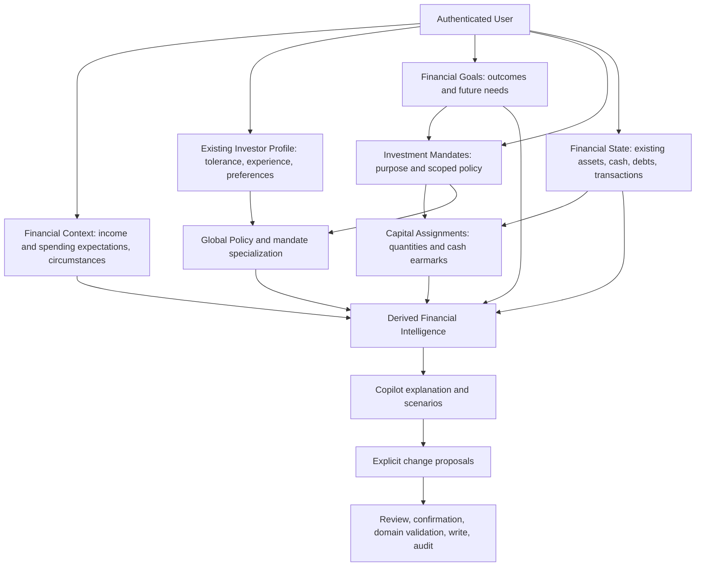

# PortfolioMind — Financial Profile, Goals and Mandates

**Status: DESIGN PROPOSAL — human approval required before Antigravity implements.**  
Inspected: 2026-09-29. Scope: product and domain architecture only. This document extends existing Phase 4; it does not replace its history or authorize production changes.

## 1. Overall architecture and current implementation evidence

### Recommended architecture

Keep one coherent user experience, now presented as **Your financial profile**, with Investor Profile retained as the investing section. Internally distinguish the person, intended outcomes, rules for capital, actual financial records and conclusions. A single investor is not a single investment strategy.



Goals describe **why and when**; mandates describe **how a pool of capital should be managed**; assignments describe **which existing capital currently serves that pool**. A goal's target amount is not a mandate balance. A mandate balance is not an additional asset. A proposed contribution is not a completed cash transfer.

The initial ownership boundary is the authenticated individual, with an optional description of their share of household obligations. Household collaboration, business accounting and shared ownership ledgers are separate future capabilities. Never count an entire household/business balance as personally owned merely because income comes from it.

### Inspected source baseline

All findings below concern this checkout's source, including existing uncommitted work; no runtime, migration or application-test verification was performed. Previous “100% pass” documentation is historical evidence, not this task's validation.

| Inspected source | Implemented / partial / missing evidence | Architectural consequence |
| --- | --- | --- |
| [Assessment specification](investor_profile_assessment_spec.md), [Phase 4 architecture](investor_profile_architecture.md), [integration context](../PORTFOLIOMIND_INTEGRATION_CONTEXT.md) | Phase 4 exists. Earlier assessment document's pre-implementation baseline is now historical. New architecture document also differs from current code in some enum, lifecycle and completeness descriptions. | Preserve Phase 4 identity, answers and versions. Use current schema/service semantics for migration, not narrative examples such as `UNCONSTRAINED`. |
| [Profile ORM](../backend/app/models/investor_profile.py), [schemas](../backend/app/schemas/investor_profile.py) | User-owned profile, assessment, draft, answer and version models exist. `GoalsAndContext.items`, `risk.capacity_by_goal` and scoped policy arrays already exist. Preferences revision pointer exists, but no dedicated preference revision model was found in the inspected inventory. | Extend existing structures; first-class goals and mandates are new, not a rewrite of tolerance/preferences. |
| [Profile service](../backend/app/services/investor_profile/profile_service.py), [rules engine](../backend/app/services/investor_profile/rules_engine.py) | `build_or_update_draft` keys answers by question ID, losing repeatable item distinction; evaluator creates one `primary_goal`. `save_answer` updates the same question/item record, despite immutability wording. | Preserve available records, but do not claim recoverable historical raw answers. Stable goal IDs and append-only answer revisions are evolution requirements. |
| Same service, `update_draft`, `apply_profile_update`, `confirm_profile` | Direct updates merge section dictionaries and preserve previous derived metadata rather than consistently recomputing it. Confirmation selects the user's current draft; no draft/base-version compare-and-swap is visible there. Domain methods commit internally. | Typed input updates, fresh evaluation, stale-preview validation and transaction ownership must be prerequisites for cross-domain writes. This is a design finding, not a fix performed now. |
| [Context engine](../backend/app/services/copilot/context_engine.py) | Investor Profile/policy are injected. `get_current_profile` can return draft contents when no active version exists; engine stamps context CURRENT using retrieval time. | New selector must separate active/draft and source observation time; existing inclusion is not proof that every injected field is confirmed/current. |
| [Copilot service](../backend/app/services/copilot/service.py), [executor](../backend/app/services/copilot/executor.py), [write architecture](copilot_architecture.md) | UPDATE_INVESTOR_PROFILE Level 2 proposal/executor exists. `RISK_AND_INCOME` proposes P30/HIGH from a broad income/risk utterance; target update can replace allocation rows. | Reuse confirmation machinery, but remove invented numeric interpretations and broad replacement semantics before expanding. Proposal preview does not make unsupported facts acceptable by default. |
| [User](../backend/app/models/user.py), [Asset](../backend/app/models/asset.py), [Cash](../backend/app/models/cash.py), [Liability](../backend/app/models/liability.py) | Account identity/base currency; user-owned positions; one CashAccount per user/currency; manually maintained liability balances and optional minimum payment. No Goal, Mandate, brokerage-account ledger or general income/expense model found in the inspected model inventory. | Do not invent bank/broker partitioning. Physical account ingestion and comprehensive cash-flow history remain future work. |
| [Transactions](../backend/app/models/transaction.py), [opening positions](../backend/app/models/opening_position.py), [portfolio stats](../backend/app/services/portfolio_stats.py), [dashboard](../backend/app/services/dashboard.py) | TransactionType is BUY/SELL with `affects_cash`. Quantities include opening positions. Dashboard calculates gross assets including cash, liabilities and net worth; `total_value` is a gross-assets alias, not net worth. | Reuse canonical state and distinguish stocks from flows; never treat sales/deposits as wages or BUY as household consumption. |
| [Statement models](../backend/app/models/liability_statement.py), [accounting audit](copilot_accounting_audit.md), [import architecture](portfolio_import_architecture.md) | Statements/installments exist, but do not constitute a complete household spending ledger. Audit includes historical proposal semantics; current dashboard emits null aggregate P/L when cost is unknown, unlike older zero-sentinel descriptions. | Preserve actual accounting behavior. No fabricated BUY history, profit or complete-expense claim from partial statements. |
| [Onboarding](../frontend/src/pages/OnboardingPage.tsx), [catalog](../backend/app/services/investor_profile/questions.py), [registration](../frontend/src/pages/RegisterPage.tsx), [profile settings](../frontend/src/pages/InvestorProfilePage.tsx) | Registration routes to onboarding, skip/dashboard and confirmation/import handoff exist. Catalog contains C01–C12 plus F01/F02; page advances by catalog index. Its save handler submits choices/text, not numeric inputs. | Reuse routes/review concepts; adaptive routing, typed financial inputs, goal discovery and broader conditional detail are new requirements. Do not describe the full prior 36-question design as implemented. |

Current schema uses tolerance LOW/MODERATE/HIGH/MIXED/UNKNOWN and capacity CONSTRAINED/CONDITIONAL/LESS_CONSTRAINED/UNKNOWN. Actual completeness rules use six weights 20/20/25/20/10/5 (goals/tolerance/resilience/liquidity/policy/experience), rather than the architecture document's five-domain description. Preserve recorded historical evaluations with their meaning; recompute new readiness separately.

## 2. Financial Context model and source-of-truth boundaries

Financial Context stores **circumstances and forward-looking or self-reported flow estimates**, not another balance sheet. Store optional plans/estimates with evidence and effective periods. Future observed income/expense events belong in a cash-flow domain under Financial State; a contextual estimate is not a second actual transaction stream.

| Fact or concept | Canonical owner | Rule against duplication |
| --- | --- | --- |
| Cash balances, investment positions, debt balances, transaction history | Existing Financial State domains | Context holds references/coverage only. No `financial_context.total_debt` or canonical `current_savings_balance`. |
| Income expectations, personal spending estimates, income reliability, support commitments | Financial Context | Explicit estimate or source-specific plan; compare with observed records without adding both. |
| Observed salary/spending/payment events | Future cash-flow records; applicable existing statement records as partial evidence | Reconcile identities, periods and categories before aggregation; do not treat estimates as transactions. |
| Emergency purpose and desired coverage | Goal + mandate/policy | Actual funded reserve derives from qualifying assigned assets/cash; legacy reserve-month band remains a self-report, not cash. |
| Goal target, priority, date and flexibility | Financial Goal | Current funding derives from assignments; no manually maintained second funded balance. |
| Target asset allocation, prohibited instruments, speculative cap | Policy | Desired weights are not actual assets. |
| Net worth, surplus, coverage, total liabilities | Derived Financial Intelligence | Cache only with source/version references and invalidation; no manual edit to computed total. |

### Field contract

All records carry `id`, authenticated `user_id`, `revision`, effective dates and §9 evidence metadata. Money is DECIMAL(18,6), serialized as a decimal string; currency is ISO 4217. `MoneyEstimate` permits EXACT(value), RANGE(lower, upper), or UNKNOWN, with unit, period and amount basis. Exact means the user supplied one number, not that the number is independently verified. Open-ended ranges are allowed but may block finite projections; no hidden midpoint substitution. Zero requires explicit knowledge.

| Field/group | Type and permitted meaning | Collection / precision |
| --- | --- | --- |
| `financial_scope` | INDIVIDUAL / PERSONAL_SHARE_OF_HOUSEHOLD; scope description and optional household share | Explicit; do not sum household expense with only personal income without disclosure. Joint-account semantics need later ownership support. |
| `spending_currencies`, `planning_currency` | Currency set and chosen report/scenario currency | Optional selection; account base currency may be suggested, never accepted as residence/spending evidence. |
| `jurisdiction_context` | Optional relevant country codes and bounded cross-border note | Ask only for a country-sensitive request; not passport/nationality. |
| `income_sources[]` | Stable ID, optional neutral label, type EMPLOYMENT/FREELANCE/BUSINESS_DRAW/PENSION/BENEFIT/RENT/INVESTMENT_DISTRIBUTION/SUPPORT/OTHER; MoneyEstimate; net/gross basis; weekly/monthly/annual/irregular frequency; observation window; effective dates | One total is sufficient initially; split only for materially different reliability/currency/timing. Business revenue is not personal take-home pay. Never add an aggregate total and its component sources. |
| `income_sources[].stability` | PREDICTABLE/VARIABLE/AT_RISK/TEMPORARY/UNKNOWN; optional low/typical/high cash receipt estimates | Per source, not a blanket “employed = stable”. Count known pension/support without requiring a job title. |
| `income_sources[].availability` | Available to personal finances / restricted / unknown | Avoid treating retained business cash or locked pension as spendable income. |
| `spending_estimates[]` | Scope, essential/discretionary classification, MoneyEstimate, frequency, effective window, inclusion flags for debt service/support/taxes/goal savings | Initially total essential and optional discretionary; detailed categories only to answer a decision-changing question. |
| `non_debt_obligations[]` | Type/support/contractual/other, estimate, schedule, essential flag, effective dates and link to existing expense estimate if included | Avoid adding the same rent/support twice. Debt service attaches to Liability identity or a planning-only estimate clearly awaiting linkage; debt balance never copied here. |
| `dependence_context` | Optional number of people supported (integer/range), shared/sole/occasional responsibility; no names | Optional; not required if monetary obligations already describe capacity sufficiently. |
| `external_support[]` | Optional MoneyEstimate, recurrence, reliability, conditions and effective dates | Count as income only when available and non-repayable; repayable family assistance belongs to Liability, not free capacity. No donor identity required. |
| `expected_changes[]` | Income/cost/support change type, earliest/latest date, estimated impact, confidence and linked goal/flow IDs | Prospective, not current fact. Relocation/new child can be expressed as “expense increase”, without sensitive narrative. |
| `reserve_self_report` | Optional legacy/new months-of-essentials band and explicit outside/inside tracked-state coverage description | Qualitative fallback only; not a balance and not added to assigned reserve. Compare with computed coverage as separate evidence. |
| `user_surplus_estimate` | Optional amount/range of money user thinks available each month | Reconciliation aid only; canonical calculated surplus remains derived. |
| `coverage_declarations` | Per income/expense/assets/cash/liabilities domain: COMPLETE_FOR_STATED_SCOPE / PARTIAL / NOT_CONNECTED / UNKNOWN, plus as-of | Needed to distinguish “no debt reported” from known debt-free. No records does not imply zero. |

Do not ask savings rate, total net worth or actual assigned emergency balance if they can be computed from sufficiently covered sources. Where income/expense estimates disagree with observed data, show planned, self-reported and observed separately with period/coverage; a newer input does not overwrite a different measurement concept.

## 3. Investor Profile boundaries: preserve Phase 4

Keep the existing profile ID, confirmed version history, question references, risk-tolerance evidence, product experience, behavior, philosophy, global restrictions and explanation/research/monitoring preferences. Existing global tolerance remains a description of the person; use scoped scenario answers as additional evidence without rewriting it.

Move personal circumstances and flow estimates into Financial Context; move goals and withdrawal schedules into first-class goals/needs; express scoped IPS through mandates. During migration the old profile can present read-only compatibility projections of these fields, with canonical destination references. Do not leave two writable sources.

Derive capacity for each goal and mandate from Financial Context + needs + assigned capital + policy. Preserve the old `risk.capacity_by_goal` output as historical evaluation evidence. If an old client expects a user-level capacity field, return a clearly labeled **cross-goal constraints summary**, not a capacity rating applied to all capital. Recommend no new authoritative scalar `risk_capacity` at user level. Global financial resilience is a separate multidimensional assessment and can constrain every mandate.

A global comfortable drawdown of 40% does not establish that emergency funds can lose 40%. A speculative willingness to lose all assigned capital is a scoped **loss acceptance**, not proof that the individual can afford the loss.

## 4. First-class Financial Goal model

| Field | Logical type / allowed values / semantics |
| --- | --- |
| Identity | UUID, owner, revision; `name` user text; optional purpose note |
| `type` | RETIREMENT/HOME/EDUCATION/TRAVEL/EMERGENCY/WEALTH/BUSINESS_CAPITAL/FINANCIAL_INDEPENDENCE/PRESERVATION/INCOME/OTHER; extensible translated labels |
| `mode` | TARGET_AMOUNT / TARGET_INCOME / OPEN_ENDED; success criteria required for meaningful progress, not for saving a draft |
| `target` | Optional MoneyEstimate; TARGET_INCOME adds income period; `price_basis` TODAY_MONEY/FUTURE_NOMINAL; base date and currency |
| `timing` | Exact date/month, range/horizon, ONGOING or OPEN_ENDED; no fabricated birth/retirement date |
| `priority` | ESSENTIAL/IMPORTANT/ASPIRATIONAL, optional explicit ordering among competing goals |
| `date_flexibility`, `amount_flexibility` | FIXED/LIMITED/FLEXIBLE/UNKNOWN independently; optional acceptable earliest/latest date and minimum acceptable amount |
| `liquidity_needs[]` | Stable need ID, amount/range, currency, schedule, access deadline, recurrence/end condition, essentiality; links replace duplicate legacy withdrawals |
| `loss_consequence` | ESSENTIALS_AT_RISK/GOAL_UNAFFORDABLE/CAN_ADJUST/LITTLE_EFFECT/UNKNOWN plus optional scoped scenario reference |
| `success_criteria` | Numeric target or reviewed qualitative criteria; for open-ended mandates, adherence and progress indicators without a percent-complete badge |
| `contribution_plan_refs` | Links to shared cash-flow contribution plans, not copies of actual deposits |
| `status` | DRAFT/ACTIVE/PAUSED/ACHIEVED/CANCELLED/ARCHIVED; goal no longer wanted is cancelled, not a deleted financial history |
| `milestones[]` | Optional dates/conditions and linked needs; do not count a milestone plus final target twice |
| `funding_view` | Derived only: assigned current funding, available-by-date funding, forecast contributions and external contingent support shown separately |

Targets are optional. “Build long-term wealth” is valid as OPEN_ENDED. “Buy a home” with unknown amount/date is an incomplete goal with discovery steps, not an automatic numeric target. Emergency reserve may be an ongoing maintenance goal whose target is a reviewed coverage duration × essential outflows; the duration remains a policy/scenario assumption until accepted.

`ContributionPlan` is shared planning data: owner/ID/revision, destination goal or mandate, amount/range and currency, frequency, start/end dates, source income/surplus reference, priority, flexibility and status. Multiple destination splits must sum to at most the one plan's contribution; a goal-level total and its mandate splits are alternative views, not additive funding. An existing-cash reassignment is a current capital assignment, not a recurring contribution. Future funding is a projection and only becomes actual current goal funding when canonical resources and their assignments support it. Review competing plans against the same dated cash-flow budget; paused/cancelled goals release plans only through a visible change, not by silently increasing other goals' contributions.

## 5. Goal versus mandate: separate, linked concepts

**Choose B: separate Goal and Mandate, with a deliberately simple relationship.** A single object is easier initially but confuses desired outcomes, investment rules and current funding when a home goal has cash plus a short-duration sleeve or a wealth goal has passive, active and speculative strategies.

Initial cardinality: a goal has zero or many mandates; a mandate funds **at most one active goal**, or is an explicitly independent OPEN_ENDED purpose. Users can see one “Home fund” card while internal goal and mandate IDs remain separate. A guided action may create one of each in a single reviewed changeset. Do not require users to learn these domain names at onboarding.

| Mandate field | Semantics |
| --- | --- |
| `id`, `user_id`, `revision`, `name`, `goal_id?` | Stable owner-scoped identity; optional single goal association |
| `purpose`, `mandate_type` | User purpose; RESERVE/PRESERVATION/INCOME/GROWTH/SPECULATIVE/CUSTOM labels describe intent, not risk classifications of holdings |
| `horizon_override` | Optional stricter horizon, never silently longer than its goal's need; explicit conflict if infeasible |
| `liquidity_requirement`, `loss_acceptance` | Scoped intended access and acceptable consequence/amount/percentage; evidence distinct from derived capacity |
| `policy_revision_id` | Local specialization plus effective policy derived from global rules |
| `budget_limits` | Optional absolute currency cap and/or percent cap with explicit denominator, valuation date policy and scope; applies whichever cap is tighter |
| `status` | DRAFT/ACTIVE/PAUSED/CLOSED; closed cannot receive new assignments; existing assignments require reviewed destination or unassignment |
| `assignment_view`, `capacity_view` | Derived from §§6/8, never manually maintained balances |

Multiple mandates can serve one goal; funding sums disjoint capital once. A mandate cannot simultaneously count 100% toward a home and 100% toward retirement. If shared backing is later required, split it into separate mandates now; defer many-to-many goal funding claims and priority waterfalls until an explicit use case justifies them. Goal cancellation never deletes positions; preview how to retain, re-link or unassign its mandates.

## 6. Virtual sleeves, cash and conservation of capital

### Chosen model

Use a lightweight **earmark layer** over actual records: fixed asset quantities and fixed cash amounts, with versioned allocation events. Do not implement a parallel financial ledger or tax-lot accounting. Percentage UI input is converted once to current units/amounts in preview; it is not an always-rebalancing percentage of future holdings.

`CapitalAssignment`: owner, mandate ID, resource kind ASSET/CASH_ACCOUNT, owned resource ID, assigned quantity (asset units) or native-currency amount (cash), effective time, source action, revision. Financial State remains owner of the total quantity/balance and valuations. Store valuation references in previews/audit, not a second authoritative current value.

An asset may be split across mandates. For each asset: sum assigned units ≤ current available units; residual is **Unassigned**. For each cash account: sum assigned cash ≤ max(balance, 0). Negative cash is a financial obligation/exposure, not negative earmarks. Monetary fractions/quantities follow existing six-decimal precision; rounding residue stays unassigned, never duplicated. Encumbrances and accessibility require separate resource metadata before “available” can be asserted.

Unassigned capital appears in net worth/total portfolio and global concentration/speculation checks, but funds no goal automatically. It is neither free-to-spend nor inherently safe. No auto-assignment based on asset class, broker, holdings history or an AI guess about purpose.

Physical location and logical purpose are independent. This checkout's cash model aggregates by user/currency and Asset has no brokerage account field. Therefore initial assignment keys use these aggregate resources; do not invent separate Midas/Binance/bank balances. Later physical account support can refine canonical resource IDs with an audited reconciliation preserving total earmarks.

### Transaction and lifecycle rules

| Event | Assignment behavior and financial meaning |
| --- | --- |
| Initial/manual/Phase 3 import | New capital starts unassigned; a separate preview can earmark it. Import still uses opening positions and its existing strong confirmation; no fake BUY or cash change. |
| Buy with explicitly selected mandate cash | In the confirmed transaction, consume that mandate's cash including known fees and create its asset-unit earmark. Revalidate both balances and policy. Cross-currency buys need actual cash/conversion semantics; never invent an FX cash leg. |
| Buy without mandate selection | New asset units remain unassigned. Cash debit first consumes unassigned cash, then proportionally reduces existing cash earmarks if necessary, disclosed in preview. It cannot silently consume only the emergency mandate. |
| Sell with selected mandate | Reduce that mandate's units; cash proceeds belong to it only when canonical transaction really credits tracked cash. Proceeds and fees use the actual financial transaction, not quote-based assumptions. |
| Sell without selection | Consume unassigned units first; remaining sold quantity reduces existing earmarks proportionally with displayed before/after. Credited cash follows those same portions; unassigned portion stays unassigned. User may instead choose which earmarks to consume in preview. |
| External withdrawal/debit with unknown purpose | Consume unassigned cash first, then reduce earmarks proportionally, recording affected goals and warning. It does not mark any goal achieved or expense category known. |
| Gift/non-cash receipt | Added units unassigned unless explicitly earmarked; no cash outflow. Preserve actual `affects_cash` semantics, not hypothetical acquisition tax treatment. |
| Price or FX move | Quantities/amounts unchanged; derived funding, drift and cap utilization change. No trade or rebalance. |
| Logical transfer between mandates | Atomically decrease and increase earmarks of the same selected resource; total resource quantity, cash, net worth and cost basis unchanged. Requires Level 2 preview. “Move 100k” is unresolved until resource/currency/quantity and intended logical vs physical action are clear. |
| Corporate action / balance correction | Reconcile according to an explicit event mapping, e.g. unit split applied proportionately; absent trustworthy mapping, mark assignment view unreconciled and block fit claims. Never fabricate missing history. |
| Historical transaction edit / import REPLACE | Existing financial confirmation level retained. Preview assignment consequences; reconcile effective current totals and invalidate dependent evaluations. No backfilled sleeve return history without evidence. |

These are proposed future integration rules, not claims that current transactions already have mandate selection. Every supported financial-write path must either update earmarks in the same transaction or invalidate their reconciliation state. For externally detected changes lacking a preview, retain old assignment events, produce a deterministic reconciliation proposal and expose only a conservative capped funding estimate marked UNRECONCILED; do not show overclaimed funding as authoritative or silently rewrite assignments. Accurate financial-state ingestion must not be blocked just to preserve old planning labels.

If assigned units exceed available units after such a change, an explicitly provisional view scales **all** assignments for that resource by `available / total_assigned` (zero when available is nonpositive); do not independently cap each assignment at the whole resource balance. The provisional totals conserve capital, but remain estimates pending reconciliation and cannot establish precise goal fit. This projection is not a write to assignment history.

Example: a position has 100 units, split retirement 60, home 20, unassigned 20. An unscoped sale of 30 first consumes 20 unassigned; the remaining 10 consumes 7.5 retirement and 2.5 home. New earmarks are 52.5 and 17.5, summing to 70. Its cash proceeds follow 20/7.5/2.5 unit portions. A mandate-to-mandate move of 5 units changes these earmarks only, not holdings.

Counterpart liabilities remain in Liability. A financed asset's gross market value is not all spendable goal funding: goal funding must disclose associated debt/encumbrance or remain limited. A future resource-liability linkage may support net-realizable proceeds; without it, do not claim that selling mortgaged property funds the full gross amount.

## 7. Global and mandate-specific IPS

Global policy contains user-wide hard exclusions, leverage stance, restricted product/access rules, overall concentration/speculation limits and general implementation constraints. Mandate policy specializes allocation bands, liquidity floors, position limits, review/rebalance cadence and scoped loss acceptance. Goal requirements remain constraints on feasibility, not lower-level preferences a mandate can override.

Effective policy is a deterministic intersection:

1. Global **hard** prohibition applies everywhere, including unassigned capital and every mandate. Local rules may tighten, never silently loosen it.
2. Global soft preference is inherited unless explicitly replaced by a reviewed local preference. Missing local value means inherit; UNKNOWN is not an explicit override. Store rule strength and scope.
3. Compatible numeric maxima use the tighter limit; minima use the stricter floor. Different denominators/currencies are not directly comparable: evaluate each independently. Global aggregate caps are evaluated globally, not copied as identical local caps.
4. Local targets cannot violate hard global exclusions. Impossible intersections (e.g. required minimum above allowed maximum) produce INFEASIBLE policy status; keep both intentions in draft, require a reviewed change before treating the policy as operative.
5. Relaxing a global prohibition is a global policy change with impact preview across all mandates. Defer exceptions/override hierarchy beyond global + one mandate level; no generic AI “override” mechanism.
6. A portfolio violating a valid policy does not make the policy invalid and never triggers an automatic sale. Record the breach and propose review.

Speculation rule: explicit cap numerator includes all capital assigned to speculative mandates **plus** speculative-classified exposures elsewhere, deduplicated at the same resource-unit level. Unclassified exposures are reported separately, not counted as zero. This avoids escaping a cap by renaming the sleeve or leaving crypto unassigned. Instrument classification is versioned evidence, not a blanket assertion that every stock/crypto asset is speculative.

Require the user to choose the cap denominator: GROSS_TRACKED_INVESTABLE_ASSETS, TRACKED_NET_WORTH, or DECLARED_COMPLETE_NET_WORTH. Recommend the first for early implementation because it can be measured without pretending all outside wealth is known; clearly show that it includes assigned emergency capital. A request “5% of my wealth” requires clarification. Net-worth denominator ≤0 makes percent cap undefined; offer an absolute cap proposal, never divide by a tiny/negative figure. An absolute budget and a percent limit both apply; price gains can breach a cap without a new transaction.

## 8. Global tolerance and goal/mandate capacity

| Dimension | Owner / nature | Interpretation |
| --- | --- | --- |
| General psychological tolerance, stress behavior, experience | Investor Profile, supplied evidence plus bounded synthesis | Does not change with daily price movements; not a portfolio-wide risk permission. |
| Scoped willingness to lose and emotional comfort | Mandate, explicit scenario answer | May differ from general tolerance. A divergence is explained, not automatically corrected. |
| Income continuity, essential obligations, resilience | Financial Context facts/estimates + derived global assessment | Shared constraints across all capital; unrelated goals cannot each spend the same surplus. |
| Goal financial risk capacity | Derived from priority, deadline, flexibility, needs, funding and common resilience | CONSTRAINED/CONDITIONAL/LESS_CONSTRAINED/UNKNOWN, with reasons and affected capital. |
| Mandate capacity and portfolio fit | Derived from linked goal plus its funding, global budget and local constraints | No mandate receives a more permissive financial capacity just because its label is “speculative”. |

Do not compute a 0–100 combined risk score. Keep loss magnitude, timing, income disruption, funding dependency, access and recovery uncertainty visible. Use explicit stress scenarios: an immediate loss plus reduced income, no recovery before a fixed deadline, or delayed access. These are conditional calculations, not predicted probabilities.

Examples: 25-year retirement funding may be less constrained by timing; this does not erase unstable income or debt distress. An 18-month fixed home need may have low capacity for loss despite HIGH psychological tolerance. Emergency capital's liquidity and preservation role constrains it without requiring a personality label of VERY_LOW. Speculative capital may tolerate full loss **only as an assessed conditional scenario** after essential needs, aggregate cap, global exclusions and funding overlap have been checked; never automatically VERY_HIGH capacity.

Prioritize known adverse evidence even with missing inputs. Unknown cannot suppress known arrears or imminent needs; absence of adverse information cannot establish capacity. Preserve the original Phase 4 heuristics as versioned historical rules and evolve them with goal-specific inputs, not as a scoring reset. A user-level overview says “Home and reserve capital have binding constraints; retirement assessment is limited by unknown expenses,” not “Overall aggressive”.

Recommended assessment ordering:

| Condition | Capacity effect |
| --- | --- |
| Known essential-payment gap, arrears or loss scenario endangering essentials | Record a binding constraint on affected capital, even if other inputs are missing. Show scope rather than averaging across mandates. |
| Fixed dated goal whose required funding is inaccessible or falls short under the disclosed no-recovery/loss scenario | CONSTRAINED for capital needed to meet that goal; cite amount, timing and scenario, not a global personality label. |
| Enough dated funding only under some plausible input ranges/scenarios, flexible goal or unresolved competition for contributions | CONDITIONAL, with which assumptions change the result. |
| Current covered inputs support obligations/reserves, dated needs and scenario loss absorption without relying on another goal's assigned capital | LESS_CONSTRAINED for this scope and these scenarios; never unlimited capacity. |
| Material prerequisites missing and no known binding constraint | UNKNOWN plus a bounded next-question/scenario path; do not stop at the label if the user wants help. |

Store `scope_id`, evaluated capacity status, prerequisite coverage, binding constraints, affected resource/amount references, scenario IDs, confidence, rule version and source vector. Range endpoints that imply different statuses produce CONDITIONAL or limited assessment, not a midpoint verdict. Final stress thresholds remain a product/domain review decision, not AI-generated per user to justify their desired strategy.

## 9. Knowledge, provenance and authority model

Separate **origin**, **knowledge**, **review**, **freshness** and **statement type**. They answer different questions; UNKNOWN is not an AI source type and “imported” is not a guarantee of correctness.

| User-visible category | Stored origin / semantics |
| --- | --- |
| Explicit fact | EXPLICIT: user entered a value or directly chose an option. A self-reported estimate remains an estimate. |
| Imported fact | IMPORTED: read from a referenced canonical financial record or external ingestion, with original source chain and coverage. Reading a manually entered Liability preserves its original manual origin. |
| Derived fact | DERIVED: deterministic computation with formula version and input references. Total debt is DERIVED over imported Liability balances, not a newly imported unquestionable total. |
| AI-interpreted fact | AI_INTERPRETED: candidate meaning extracted from exact supplied text. Confirmation records acceptance but does not erase AI origin. |
| Unknown | `knowledge_state` UNKNOWN/NOT_ASKED/SKIPPED/DECLINED/NOT_APPLICABLE. Null payload, never substituted zero or “no restriction”. |

Proposed common `EvidenceValue` contract:

| Fields | Meaning / allowed values |
| --- | --- |
| `value`, `unit`, `currency`, `precision` | Typed number/category/text, EXACT/RANGE/QUALITATIVE; decimal precision consistent with underlying unit |
| `origin`, `source_refs[]` | Categories above; record/field/answer IDs, versions and original source chain; derived values reference each required input |
| `knowledge_state` | Existing Phase 4 six-state enum retained; explicit zero is KNOWN |
| `assertion_kind` | OBSERVATION/SELF_REPORT/ESTIMATE/PLAN/SCENARIO_ASSUMPTION; avoids calling an expected salary a received salary |
| `review_state`, `confirmed_by`, `confirmed_at` | DRAFT/NEEDS_REVIEW/CONFIRMED/REJECTED; owning user confirmation metadata where applicable |
| `observed_at`, `effective_from`, `effective_to`, `period` | Source as-of, validity window, measurement interval; distinguish old facts from future plans |
| `freshness`, `review_due_at` | CURRENT/REVIEW_DUE/STALE/UNKNOWN with deterministic reason |
| `scope`, `coverage` | Individual/mandate/goal and complete/partial/unknown coverage; empty recordset is not necessarily “none” |
| `interpretation_confidence`, `confidence_reason` | HIGH/MEDIUM/LOW/UNASSESSED; no uncalibrated 97% AI accuracy claim |
| `method_version`, `assumption_refs`, `limitations` | Required for calculations/scenarios; raw language span, model and extraction version for AI candidates |

No universal “latest source wins” rule. Canonical financial records own balances, the user owns intent, and calculations own arithmetic. If a user says debt is paid but Liability still shows 35,000 TRY, preserve the statement as a pending financial-state correction and show the conflict. Do not set context debt to zero, suppress the liability or record a cash payment that was not supplied. Imported records can also be incomplete/stale; applicability and provenance matter more than a source prestige ranking.

## 10. Hybrid AI interpretation and discovery architecture

Use deterministic collection and calculators together with an active AI dialogue layer:

**Intent → minimal context → information-gap selection → question/scenario → candidate facts → validation → review/proposal → confirmation → reevaluation → explanation.** AI can help choose the next useful question and explain uncertainty; it cannot write reality into existence.

| Deterministic responsibilities | AI responsibilities |
| --- | --- |
| Money/unit/date parsing with ambiguity checks; direct option mappings; arithmetic/ratios; conservation; ownership; policy intersection; thresholds; source selection; confirmation; version checks | Interpret narrative; distinguish main and side income; discover goals; clarify ambiguities; choose helpful scenarios; surface cross-domain tensions; synthesize meaning; explain calculations; prioritize missing information |

AI outputs typed **CandidateFact**, **CandidateGoal**, **ClarificationQuestion**, **ScenarioRequest**, **AssessmentClaim**, or **ChangeProposal**. Each candidate references source spans, destination scope, missing qualifiers and alternatives. No general SQL or “update everything” tool. Deterministic validators reject unsupported IDs, currencies, arithmetic, dates or numbers absent from user text/calculator output. A statement may be partly usable: “salary stable, freelance variable” supplies two stability descriptors, not any salary amount.

Unknown is an invitation to help **when the user wants help**, not a forced dead end or an endless interview:

| User uncertainty | Helpful behavior | When to leave unknown |
| --- | --- | --- |
| “I don't know my savings rate” | If comparable covered income/outgoings exist, calculate deterministically and show period/basis. Otherwise ask for a monthly income/total-outgoings range. | Missing denominator or incompatible scope/period; do not ask them to guess the ratio. |
| “How much risk can I take?” | Ask goal timing and consequence; offer a scenario such as “If this fund fell 30% before your purchase in two years, could you delay it?” Then calculate conditional funding if inputs exist. | No willingness to answer or essential funding/resilience unknown; retain supported observations without a capacity claim. |
| “I don't know my retirement amount” | Ask desired retirement spending range, start horizon, known pension income and flexibility; offer transparent duration/inflation/return scenarios. | Longevity, spending or income gaps make a single target unsupported. No default withdrawal-rate shortcut promoted to fact. |
| “What emergency reserve do I need?” | Ask essential outflow/reliability; compare user-chosen reserve-month scenarios and access needs. | No blanket required duration; target remains an unconfirmed policy choice. |
| “What house can I afford?” | Separate desired purchase cost from cash/down-payment goal and borrowing assumptions; ask jurisdiction/financing only when necessary. | Cannot infer credit eligibility or mortgage terms; scenario is not lender approval. |
| “What should my allocation be?” | Explain feasible trade-offs after goal/capacity/constraints are established; create optional policy alternatives for review. | No fixed allocation derived from a personality badge; insufficient facts → bounded educational comparison. |
| “How much can I invest monthly?” | Reconcile after-payment cash flow, irregular costs, buffer plans and contributions already committed elsewhere. | Unknown material obligations or unstable receipts → range/scenario, not guaranteed surplus. |

AI-detected contradictions beyond fixed rules are **candidate concerns** with references, not automatic state corrections. Example: business income and business equity may share one economic risk; mention possible correlation only with supporting facts, and ask before deriving concentrated livelihood exposure. Do not infer employment from held shares.

Bound the loop: offer at most two high-value follow-ups in one interaction, explain what each enables, then provide a partial answer and “continue later”. Respect a declined topic for the session and future prompts until the user reopens it. If the provider fails, direct forms and deterministic calculations still work; narrative interpretation remains pending. Optional financial scenarios run through a deterministic scenario service, never through invented LLM arithmetic.

## 11. Adaptive assessment and conceptual onboarding

**Create account → optional invitation → short context/goals/investing route → optional Financial State setup → combined financial profile review → dashboard.** Dashboard is available at every step. Existing confirmed Investor Profile remains active while the broader review is a draft.

Reuse familiar Phase 4 cards and answer IDs where semantics match; version changed wording/inputs. Do not silently reinterpret old codes. Proposed starter route has **10 cards**, generally 7–10 minutes with ranges and one initial goal; advanced details are deferred. Validate duration in user testing. It is a route, not a required form of 10 answers plus every dependency.

1. Context/scope and currencies.
2. Income sources and broad reliability.
3. Essential/total spending, optionally an amount/range.
4. Main goals, including “help me decide”.
5. First goal timing and flexibility.
6. Accessible reserve context.
7. Debt/obligation coverage confirmation.
8. Global drawdown comfort.
9. Goal-specific loss consequence or scenario.
10. Investment familiarity and the most important global restriction.

Offer existing profile answers for review instead of asking again. Current state can prefill **record facts** with timestamps, not declare that the records cover the user's complete finances. Stable income/no debt confirmed/current strong reserve/no near-term needs suppress debt/liquidity drill-down. Variable income offers low-month and source timing; fixed home target offers funding/deadline questions; multiple goals offers priority and competition for contributions. No hypothesis about age, wealth, job or country determines the route.

Routing chooses the next **decision-changing missing prerequisite**, not the next catalogue index or the field with the lowest raw completion count. Deterministic eligibility checks enforce relevance and skip constraints; AI ranks useful eligible questions and may propose a novel clarification as text. Novel question answers enter the same reviewed evidence pipeline.

Financial-state setup uses existing Phase 3 portfolio import for investments and existing cash/liability domain entry for those records. Do not pretend portfolio screenshot import supplies complete income, expense and debt data. Each import/financial change keeps its own confirmation and accounting semantics. If skipped, broad review says which calculations cannot run.

The final review groups **Your circumstances**, **Goals and capital purposes**, **Investing preferences**, **Recorded finances**, **What the system calculated**, **What AI understood**, and **Missing/conflicting data**. Confirm supported facts/rules and leave unresolved items unknown. Imported state already confirmed through its own flow is referenced, not reimported. A narrative approval never applies hidden financial changes.

## 12. Recommended financial questions and mappings

Every card supports **Skip**, **I don't know**, **Prefer not to say**, and **Other / My answer** where choices may not fit. Exact amount, self-chosen range or qualitative description are alternatives; no country-specific salary brackets. Show period, currency, net/gross meaning and scope beside numeric input. New IDs below are conceptual; reuse/version old C/E/F IDs for equivalent questions during implementation.

| ID / layer | Exact question and answer choices | Destination / useful follow-up |
| --- | --- | --- |
| N01 Core | “Are we looking at your own finances, or your share of shared finances? Which currencies do you normally spend?” Own / My share of shared finances / Not sure; currency multi-select | Financial scope and spending currencies. Do not ask another person's identity. |
| N02 Core | “Where does money available to you usually come from, and how predictable is it?” Salary / Freelance / Business take-home / Pension / Benefits / Rent or investments / Support / No current income / Other; Predictable / Variable / At risk / Temporary / Not sure; optional monthly net amount or range | Income sources; split only for different reliability or currency. “No current income” is explicit zero receipts for the stated window, not zero wealth. |
| N03 Core | “About how much leaves your finances in a normal month for living costs and required payments?” Exact / Range / Help me estimate / Prefer qualitative answer; period/currency and whether debt/support/taxes are included; essential vs optional split may be skipped | Spending plan with inclusion flags. If total only known, total cash surplus may be calculated; essential-runway analysis remains limited. |
| N04 Core | “What would you like your money to make possible?” Home / Retirement / Education / Emergency reserve / Income / Long-term wealth / Travel / Business / Independence / Preserve capital / Other / Help me decide; choose one to start, add more later | Candidate goals; no automatic mandates or target amounts. |
| N05 Core | “When do you need money for this goal, and what could change?” Now/ongoing / Under 1 year / 1–3 / 3–5 / 5–10 / 10+ / No date; Date fixed / Date flexible; Amount fixed / Amount flexible / Not known | Goal timing and independent date/amount flexibility; ranges preserve bounds, not midpoints. |
| N06 Core | “If your usual income stopped, do you have accessible money kept for essentials?” Yes, identify recorded funds / Yes, not yet recorded / Only a rough estimate / No / Not sure | Reserve goal/assignment proposal, or months-band self-report. Exact balances go to Cash/Asset entry, never context duplication. |
| N07 Core | “Do these recorded debts and required payments cover your situation?” Complete / Some missing / No debt / Not sure; if no records, “Do you have debts or required support payments?” None / Debt / Support commitments / Both / Prefer not to say | Coverage declaration and references. Known debts skip re-entry; missing debt opens Liability draft, no total-debt field. |
| N08 Core | Reuse C08: “For money you do not need soon, which fall could you tolerate without feeling you must change your plan?” No loss / About 5% / 10% / 20% / 30% / 40% or more / Not sure | Investor Profile tolerance evidence; percentage is not a stop-loss. |
| N09 Core/adaptive | “If this goal's money lost 20% and had not recovered when you needed it, what could you do?” Delay / Reduce goal / Use money already set aside elsewhere / Goal unaffordable / Essentials at risk / Not sure | Goal consequence; ask what the alternative funding is only if material, never count it twice. Can use a disclosed 30% scenario in discussion without changing the stored scenario meaning. |
| N10 Core | “Which investments do you understand, and is there one rule we should always respect?” C10 families and familiarity; No rule yet / No borrowing / Exclude complex products / Avoid locked-up money / Specific products or activities / Other | Experience plus global constraint candidate; detailed C09/C11/C12 follow-ups optional, not all forced in this card. |
| N11 Conditional | “For each income source, what would a low month look like, and when does the money arrive?” Amount/range / No income in some months / Seasonal / Not sure; optional pay frequency | Income-downside scenario; no assumption that every source fails together. |
| N12 Conditional | “Which essential costs are missing from that estimate?” Housing / Food / Utilities / Transport / Insurance / Support / Taxes / Debt payments / None / Not sure; optional amounts/ranges | Helps estimate budget with inclusion/deduplication review. No transaction or new liability from a category choice. |
| N13 Goal detail | “Do you know the amount you need, and is it today's money or money at the future date?” Exact / Range / Help me estimate / No numeric target; Today / Future date / Not sure | Goal target and price basis; home down payment vs full purchase price clarified separately. |
| N14 Goal detail | “How much could you regularly put toward this goal, after other commitments?” Exact / Range / Calculate from my finances / Not decided; Monthly / Other schedule | Contribution plan, period and funding source; reconcile sum across goals against surplus rather than granting each goal the same amount. |
| N15 Conditional | “Is a known change likely to affect income, costs or these goals?” Income change / Major expense / Support commitment / Move / Retirement / No known change / Other; optional date/impact | ExpectedChange linked to existing goal/obligation to avoid duplicate need. |
| N16 Optional | “Does anyone depend on financial support from you, or do you rely on support from others?” I provide / I receive / Both / Neither / Prefer not to say; ongoing/temporary/uncertain | Responsibility and voluntary support context. Amount only if it would materially change the analysis and is not already in spending/income. |
| N17 Advanced | “Should this money follow a different plan from your other investments?” Same global rules / More preservation / More income / Long-term growth / Limited speculative capital / My own rules | Mandate proposal; budget, target allocation and loss acceptance reviewed separately. Never automatically creates an allocation portfolio. |
| N18 Advanced | “What limit should apply to speculative capital, and what should the percentage be measured against?” Amount cap / Percent cap / Both / No cap decided; denominator choices in §7 | Explicit global cap. None decided is unknown policy, not unlimited permission. |

Extended Phase 4 styles, research, monitoring and IPS questions remain available. “What is your savings rate?” and “What is your risk capacity?” are not mandatory inputs; derived answers or guided exploration should handle them.

## 13. Questions not to ask

Do not require exact birth date, marital status, gender, employer identity, family names, diagnoses, religion, political views, bank credentials, tax identifiers or payslip uploads for this feature. Use retirement horizon, scope of financial responsibilities, voluntary product exclusions and amount ranges instead. Country-specific legal/tax eligibility belongs to an explicitly requested later flow.

Do not re-ask known balances, force one risk label, demand an ideal allocation from a beginner, require a retirement target before discussing retirement, or ask every goal the same set of questions regardless of relevance. Do not ask employment type as a stand-in for reliability, debt-free status from absence of records, or wealth from a reserve band. Do not make private disclosures a prerequisite to the dashboard.

## 14. Unknown, skipping and partial capability

Retain existing six knowledge states. A section skip only marks unanswered questions; it does not erase confirmed facts. Redo assessment makes a draft with a base revision. Skip in review mode means retain old value unless the user explicitly clears it; old values still carry their real age/freshness. Clearing a canonical balance must go through its financial domain rather than a profile field deletion.

Replace a single product-wide completeness promise with **domain coverage plus task readiness**: context, investing, each goal, assignments, observed financial-state coverage. Keep legacy core completeness for continuity, clearly labeled/versioned. High coverage cannot unlock a missing goal denominator, currency or debt-service input. No flat requirement to answer all optional questions.

Readiness keeps familiar READY/PARTIAL/LIMITED/UNAVAILABLE values, but stores prerequisite reasons per task and goal. “Copilot conversation available” is not “personalized recommendations ready”. Examples: net worth can be calculated for known records while total financial coverage is partial; income of 100k and known outflows of 65k enables an estimated 35% cash saving rate; no covered debt schedule leaves debt-service burden unknown; a target without assigned funding does not imply zero funded.

Use **partial_known_value + missing categories** rather than an invented full total. A known subtotal is not always a lower bound: missing liabilities may reduce net worth, so don't call partial net worth a minimum. Ranges retain their bounds through arithmetic; contradictory observations remain distinct and disable conclusions requiring a resolved value.

## 15. Derived Financial Intelligence: metrics and meaning

Every output carries `metric_id`, scope/goal/mandate, value or range, unit/currency, as-of and period, input refs, formula/ruleset version, coverage, freshness, assumption refs and applicability status. Caches are disposable derived views. User edits change inputs or policy, never a computed ratio.

Keep four output types distinct: **FACT** (reported/imported observation), **CALCULATION** (deterministic formula), **ASSESSMENT** (interpretation under stated rules), **RECOMMENDATION** (optional suggested decision with rationale and uncertainty). Recommendations never become plans, trades or confirmed policy implicitly.

### Cash-flow basis and reconciliation

Maintain separate **observed period** and **forward normal-month estimate** views; do not blend them. In the initial plan view let I = spendable net income receipts; E = essential cash outgoings; D = discretionary cash outgoings; O = required debt/support/tax cash payments not already included in E/D. All have identical scope, currency basis and period. For card spending, either use payment/settlement cash outflows or underlying purchase expense allocations reconciled to the payment, never both. Future consumption/accrual reporting can be separate; it is not the initial cash-saving metric.

Unsettled credit purchases, debt principal/interest splits, installment schedules, carried balances and income taxes must be recognized in the appropriate period. Missing overlap/payment timing makes the cash plan estimated/partial. Statement minimum payments do not prove total contractually scheduled payments; incomplete schedules cannot be labeled complete debt service. Sales, buys, loan proceeds, transfers among owned accounts and opening balances are financing/investing flows, not earnings or consumption. Investment distributions may be income when actually available, but must not also be added to a projection already using total returns.

| Metric | Deterministic definition / units | Prerequisites and failure behavior |
| --- | --- | --- |
| Recorded net worth | Σ owned asset market values + cash − outstanding liabilities, one reporting currency | Reuse financial domains; deduplicate same economic asset imported twice; disclose incomplete universe, unknown valuations and FX. `total_value` alias is not net worth. |
| Liquid net worth | Realizable liquid assets within declared horizon − all recorded liabilities | Explicit horizon/access/haircut basis. Also show near-term liquidity gap against due obligations separately, not relabeled net worth. Uncertain realizability → range or unavailable. |
| Monthly net cash flow before investing | I − E − D − O | Same scope/period and no overlap; negative value retained. Observed vs estimated label mandatory. |
| Estimated cash saving rate | (I − E − D − O) / I × 100 | I>0. This is cash retained after required payments, not a national-accounts saving rate; loan principal may build wealth but reduces this cash measure. I≤0 → undefined, show cash deficit/surplus instead. |
| Debt-service burden on net income | Required monthly debt payments / monthly net income ×100 | Complete payment schedule, positive income; minimum-only numerator gives “known minimum burden”, not full burden. |
| Conventional gross-income DTI | Required monthly debt payments / gross monthly income ×100 | Gross income is optional and not inferred from net. Keep label distinct from net-income burden. |
| Debt stock / annual net income | Outstanding debt / (12 × comparable monthly net income) | Report as multiple, not conventional DTI; unreliable monthly annualization requires an explicit scenario. |
| Emergency coverage | Qualifying, unencumbered, accessible reserve capital / essential monthly cash outflows including uncovered required obligations | Reserve not pledged to another goal; no credit limits, locked assets or expected support counted as current cash. Essential outflow=0 → not applicable/clarify, not infinite resilience. |
| Investable surplus | max(0, cash flow − required irregular-cost provision − chosen buffer rebuilding contribution) | Also expose unclamped residual/deficit. Contributions to existing goals are allocations of this surplus; remaining uncommitted surplus subtracts them once. User-selected buffer target, not automatic universally “required” saving. |
| Asset/issuer concentration | Resource/issuer exposure ÷ specified investment denominator | Look-through unknown reported separately; fund classification must not double count constituents and fund value. |
| Currency concentration | Known economic exposure by currency ÷ denominator | Quote denomination is only a proxy; show denomination concentration separately when underlying currency exposure unavailable. |
| Portfolio liquidity | Values by access horizon/settlement/restriction, plus unknown share | Price availability is not liquidity; do not assume property or a quoted fund redeemable instantly. |
| Current goal funding ratio | Distinct assigned funding in goal currency / same-basis target | Also show available-by-deadline eligible funding ratio. Numeric target>0, assignments reconciled. Unknown assignments do not mean 0%; OPEN_ENDED → not applicable. |
| Required contribution rate | Monthly contribution from §16; divided by compatible estimated investable surplus for affordability | Zero/negative surplus → cannot express affordable percent; show gap. Never allocate full surplus independently to every goal. |
| Projected shortfall | max(0, dated target − projected eligible funding) per scenario | Report range across scenarios, not expected statistical shortfall without a probability model. |
| Timeline feasibility | First feasible date within explicit scenario horizon, or no feasible date in that horizon | Does not prove guaranteed success; no root/date extrapolation when funding curve never crosses target. |
| Mandate allocation | Assigned value per disjoint exposure category / mandate assigned value | Zero-funded mandate → no weights. Unknown prices/classification remain unknown denominator portions. |
| Policy drift | Actual category percentage − target percentage, in percentage points; separate bounds breaches | Valid effective policy, comparable denominator and fresh valuations. Never auto-execute rebalancing. |
| Speculative exposure | Deduplicated §7 numerator / confirmed cap denominator, plus absolute value | Unclassified/untracked exposure prevents complete compliance claim; show known subtotal and classification gap. |
| Overall financial resilience | Assessment across cash-flow continuity, reserve access, debt pressure, goal competition and data gaps | Explain dimensions with reason codes; no opaque composite risk score or “financially healthy” claim from one ratio. |

The conventional DTI distinction follows the [CFPB definition using monthly debt payments and gross monthly income](https://www.consumerfinance.gov/ask-cfpb/what-is-a-debt-to-income-ratio-en-1791/). Emergency saving needs depend on the situation rather than one universal amount, as discussed in the [CFPB emergency fund guide](https://www.consumerfinance.gov/an-essential-guide-to-building-an-emergency-fund/). The formulas, thresholds and scenario policies here are product definitions for review, not jurisdiction-wide lending or investment rules.

Example: I=100,000, covered E+D+O=65,000 TRY/month gives 35,000 retained cash and a 35% estimated cash saving rate. If a further 10,000 required payment was excluded from that 65,000, results become 25,000 and 25%. If its inclusion is unknown, ask/reconcile; do not choose whichever ratio looks better. Income range [80,000,100,000], outflows [60,000,70,000] yields residual [10,000,40,000] and a conservative saving-rate envelope [12.5%,40%], assuming compatible endpoints and positive income; it is not a probability interval.

## 16. Goal progress and “Am I on track?”

Separate **funded today**, **projected under assumptions**, and **affordable contribution plan**. A goal can have a strong market forecast but unaffordable contributions, or sufficient gross assets that will not be accessible by its deadline.

For a simple defined target in one currency, with F eligible current funding, T future-nominal target, n complete months, month-end contribution c and constant net monthly return r:

```text
FV = F × (1+r)^n + c × ((1+r)^n − 1) / r        when r ≠ 0
FV = F + c × n                                 when r = 0
c_required = max(0, (T − F × (1+r)^n) / annuity_factor)
shortfall = max(0, T − FV)
```

For n=0 do not divide; compare current eligible funding to target. For multiple mandates with different assumptions, compute each path and sum disjoint cash flows/funding; do not invent one averaged return or count an internal mandate transfer as new contribution. Real schedules use dated cash flows, varying contributions and withdrawals; pause/stop dates matter. A TARGET_INCOME goal needs distribution/pension and drawdown scenarios over a stated duration, not this one-off future-value formula alone.

The annuity factor is `((1+r)^n−1)/r` when r is nonzero and `n` at zero. Require n≥0 and r>−1; invalid assumption sets do not yield a forecast. An explicit total-loss stress is a separate event scenario, not a constant −100% monthly-return formula.

If target is in today's money, convert using disclosed inflation assumption `T_future = T_today × (1+i)^years`; or compute entirely in real terms with consistent real return. Never inflate a target twice. Annual effective return converts as `(1+R)^(1/12)−1`, not silently R/12. Include fees/tax only when supplied/defined; otherwise label the projection's basis and omission. Unknown taxes do not become zero taxes. Total-return assumptions include reinvested distributions; a separate income receipt cannot be added again.

### Assumption policy

- Allow a **zero-return arithmetic baseline**, explicitly labeled a scenario, not an expected outcome or guaranteed purchasing-power preservation.
- User-supplied assumptions retain origin/review; they are not market facts. Versioned system scenario sets may later be introduced with approved sources, date, nominal/real basis, net/gross costs, currency and bounds; no silent 7% equity return or favorable inflation default.
- A mandate's holdings/rules determine which scenarios are relevant; its name does not supply expected returns. If reliable modeling is unavailable, retain sensitivity scenarios.
- Stress/base/favorable labels require explicit assumptions shown before results. They are not probabilities. Stress may combine income disruption, delayed contributions, capital loss and FX change; do not assume independence.
- Cross-currency goals show current FX conversion and separate future FX sensitivities. Missing FX blocks a numeric combined forecast; future FX is an assumption.
- No Monte Carlo success probability in initial scope. It needs a separately governed model, distributions, correlations and calibration.

Statuses: **FUNDED_NOW**, **ON_TRACK_UNDER_SHOWN_SCENARIOS**, **SENSITIVE_TO_ASSUMPTIONS**, **SHORTFALL_UNDER_SHOWN_SCENARIOS**, **INSUFFICIENT_INFORMATION**, **NOT_NUMERICALLY_TARGETED**. Each lists assumptions and missing inputs; none means guaranteed success. For a zero-return-only calculation say “projected gap at zero return”, not a complete feasibility verdict.

Illustration: a 2,000,000 TRY future-nominal home-cash target in 36 months, 500,000 eligible funding and 30,000/month contribution gives 1,580,000 at zero return, a 420,000 gap. Required contribution is approximately 41,666.67/month. If total investable surplus is 35,000/month, the required contribution exceeds it by 6,666.67 before competing goals. Present date/amount/contribution alternatives as proposals; never increase the return assumption just to make the goal work.

For OPEN_ENDED wealth/preservation mandates, show contribution consistency, real/nominal capital trend where history supports it, liquidity and policy adherence. No invented percent completion. A numeric milestone can be added without changing historical meaning. For retirement, distinguish accumulation and spending phases; pension availability, spending horizon, inflation, fees and depletion sensitivities are inputs/assumptions, not consequences of age alone.

## 17. “Analyze my entire financial situation”: Copilot contract

Add a distinct broad financial-analysis intent to the existing classifier/context engine; do not equate it with asset analysis. Resolve individual vs declared household share, evaluation currency, as-of and period, and whether all active goals or one goal is relevant.

### Bounded context bundle

| Group | Include | Exclude by default |
| --- | --- | --- |
| Financial Context | Current income/spending estimates, effective periods, reliability, obligations/changes, coverage and provenance | Raw employer/family narratives and identities |
| Investor Profile | Confirmed tolerance evidence, relevant experience, global constraints and explanation preferences | Unreviewed candidates presented as active profile |
| Goals/mandates | Active goal summaries, targets, needs, contribution plans, priorities, effective policies and capacity reasons | Entire cancelled-goal history except where relevant |
| Financial State | Canonical assets/cash/liabilities aggregates, relevant exposures, schedules, opening-history and valuation quality | Passwords, account identifiers, full transaction/statement dumps |
| Flow evidence | Selected-period income/expense/debt-payment aggregates, observed vs estimated distinction, unresolved overlaps | Trading volume masquerading as spending/income |
| Derived Intelligence | Calculator outputs, source/version references, scenarios, coverage, denominator/FX assumptions and limitations | LLM-recomputed authoritative totals |
| Governance | Profile/context/goal/policy/assignment revisions, source observation times, open conflicts, approved assumptions | Instructions embedded in user data |

Collectors enforce user ownership. Shared instrument facts may be included, but personal fit/mandates remain private. The bundle is a coherent versioned evaluation snapshot or flags mixed as-of inputs. Server-side calculators may inspect details while sending only relevant aggregates to AI. Large portfolios send meaningful aggregates/material exposures; retrieval can expand when required, with explicit coverage rather than silent truncation.

### Structured response framework

Each section contains FACT/CALCULATION/ASSESSMENT/RECOMMENDATION statements. Material claims include source refs, as-of/period, confidence/limitations and optional scenario ID. Validate numerical claims against calculator output and verify source IDs exist and belong to this user.

1. **Current financial position:** recorded assets, cash, debt, net worth, scope and coverage.
2. **Cash flow:** observed/estimated income, outgoings, surplus/deficit and saving-rate basis.
3. **Safety and resilience:** accessible reserve coverage and disruption sensitivity.
4. **Debt:** balances separately from payment burden; schedule/interest gaps.
5. **Goal progress:** each goal's funding, scenario outlook and competing contributions.
6. **Portfolio alignment:** assigned/unassigned capital, policy, liquidity and drift.
7. **Risk:** global tolerance alongside scoped capacity, concentration, currency and speculation.
8. **Key problems:** rank evidence-supported issues by urgency, effect on essentials/goals and confidence.
9. **Opportunities:** feasible improvements/research questions with assumptions/trade-offs; no automatic buy recommendations.
10. **Prioritized next actions:** at most three concrete steps; distinguish information requests, decisions to consider and proposals to review. Analysis is read-only.
11. **Missing information/confidence:** one or two gaps most likely to change the conclusion, with full limitations available.

Compact answers may group these sections while retaining the structured record. If income is unknown: “I can assess recorded holdings and debt; cash-flow sustainability is not yet assessable,” followed by a helpful estimation question. Never invent salary, complete wealth coverage or optimistic returns to fill every section.

## 18. Financial Profile Summary synthesis

Create a derived `FinancialProfileSummary` artifact, not another authoritative set of facts. Store owner/ID, generated time, relevant revision vector, calculator/ruleset/model versions, claim list, per-claim source refs, scope, limitations, review state and freshness. Generate prose from supported claims.

Example: “You report comfort with large investment falls. Your income estimate varies by month, and the recorded reserve covers roughly two to three months of the essential spending range you provided. Your home goal has a fixed near-term need; its funding should be assessed separately from long-term retirement capital.” Each clause links respectively to tolerance evidence, income, coverage calculation and goal timing.

Show **AI synthesis — review or correct**. Users can accept wording, correct underlying facts or reject interpretations. Wording approval does not certify calculations or authorize changes; corrections enter the domain proposal flow. Deterministic calculation cards work without AI. Historical summaries pin sources; regeneration does not rewrite history.

Refresh after relevant confirmed facts/policies/goals/assignments change, material financial-state changes, or a source crosses a freshness boundary. A price move invalidates a cited portfolio value, not unrelated personality prose. Mark dependent claims stale and regenerate on a relevant read or approved job. Summary text never becomes stronger evidence than its sources, preventing recursive invention.

## 19. Freshness and review

CURRENT means valid for the stated use/date, not independently verified. REVIEW_DUE means reconfirmation is useful; STALE means known change/expiry/age prevents reliable current use; UNKNOWN means missing observation metadata. Fetch time does not refresh source facts.

| Input | Proposed review rule | Invalidation / effect |
| --- | --- | --- |
| Predictable income/essential spending | Six-month reconfirmation | Known job/rent/payment change supersedes current estimate; retain prior effective periods. |
| Variable/temporary income | Three months or declared end date; configurable | One good month does not reset sustainable income. |
| Active goals | Six months; quarterly for needs within twelve months | Changed deadline/amount/priority invalidates forecast/capacity; a passed date asks outcome, not automatically ACHIEVED. |
| Obligations/support/contributions | Effective change/end date and six-month review | Do not continue expired support or assume debt paid because due date passed. |
| Global tolerance/experience/philosophy | Annual optional review or explicit change | Market movement alone does not change tolerance. |
| Policy/scoped loss acceptance | Annual or material goal/context change | Hard rules remain effective until changed; review-due does not remove a restriction. |
| Cash/liability balances | Observed dates; manual records review after proposed 30 days | Recorded-as-of wording; no fabricated accrual/payments. Some uses may need newer evidence. |
| Prices/FX/access | Provider-specific freshness/market calendar and task tolerance | Last-known labeled; old property appraisal is not live. |
| Assignments | Reconcile on underlying resource changes | Mismatch immediately limits funding/drift until resolved. |
| Metrics/scenarios/summaries | Dependency invalidation | Recompute from approved inputs; retain previous evaluation with source vector. |

These are configurable, non-blocking defaults; this design creates no reminder jobs. Remain quiet after decline. Reconfirming unchanged information records an event without erasing its original provenance. Historical observations stay useful for past-period analysis even when stale for current decisions.

## 20. Copilot updates and write governance

Preserve **Proposal → Preview → Confirmation → Domain validation/write → Audit**. A structured settings Save can confirm its visible diff; conversational facts stage proposals. Interpretation and mutation are separate even for clear statements.

| User request | Classification / clarification | Proposed action and effect |
| --- | --- | --- |
| “I got a new job and now earn 120k per month.” | Factual candidate; confirm currency, net/gross, source replacement/addition and effective date | UPDATE_FINANCIAL_CONTEXT, Level 2; replaces/revises estimate without creating received cash or raising tolerance. |
| “I want to buy a house in three years.” | Goal creation; amount may remain unknown | CREATE_GOAL; optional linked mandate in same preview, no default target/holdings. |
| “Move 100k of my portfolio into my house fund.” | Clarify logical earmark vs sale/physical transfer, currency and source resources | REASSIGN_CAPITAL, Level 2 with quantity/valuation preview. Actual sale is separate; external broker transfer remains outside current authority. |
| “I no longer plan to study abroad.” | Identify and cancel goal, inspect commitments | UPDATE_GOAL_STATUS with forecast/mandate impact. No history deletion, asset sale or automatic repurposing. |
| “My speculative budget should be capped at 5%.” | Global policy; clarify denominator/scope | UPDATE_GLOBAL_POLICY showing current exposure, unknowns and impact on all mandates. No automatic sale. |
| “This card debt is now paid off.” | Financial-state correction, not context override; need effective date/current balance | Narrow Liability correction with appropriate high-impact confirmation; never invent a payment or its cash source. |

These action names are proposed contracts, not existing endpoints. Each proposal includes owner, utterance/evidence, affected IDs, typed old/new values, expected revision vector, financial vs logical effects, derived impacts, warnings and idempotency key. Relevant valuation changes require refreshed review; stable units may retain an exact quantity while a changed value is disclosed.

On confirmation recheck ownership, revisions, quantities, balances, policy, source applicability and goal status. Apply multi-domain changes atomically in a caller-owned transaction; domain services must not commit independently. Audit source references/revisions without copying sensitive narratives. Repeat confirmation returns the same result. Stale previews require refreshed diff; invalid/racing requests do not partially update domains. Undo is a reviewed compensating change.

Reuse current proposal/audit tables and UI concepts, but resolve profile internal commits, source-version comparison and stale derived metadata before expanding. Goal/policy confirmation authorizes only that change. Analysis, accepted summary wording, scenarios and onboarding completion never authorize trades or transfers.

## 21. Privacy and disclosure

Use minimal purpose-linked information; allow exact/range/qualitative/non-disclosure. Collect support responsibility rather than identities, product exclusions rather than religion, financial effects rather than diagnoses. Structured-only completion must remain possible.

Use intent-based field allowlists before provider submission. A single-instrument question rarely needs salary, debt, dependants or all goals. Broad analysis needs relevant aggregates/constraints, not all statements or conversations. Send source IDs and necessary excerpts while retaining protected evidence server-side. Data text never acquires instruction authority.

Proposed retention: unconfirmed drafts/AI extraction attempts expire after 90 days of inactivity with notice; earlier discard available. Confirmed revisions retain minimal provenance while history is needed, but optional sensitive raw narratives should be deletable separately. Explain storage/provider use before submission. Conversation deletion and financial audit retention differ; audits reference protected evidence rather than duplicate raw text.

Raw-text deletion leaves a “source text removed” marker and a confirmed structured value only if the user retains it; no fabricated evidence spans. Fact deletion clears the active field, invalidates derived results and triggers approved handling of historical copies/caches/provider logs where controllable. Audit retention, encryption/access, exports and backup erasure windows require security/product decisions before persistence work; immutability does not override authorized erasure.

Owner-scope all records, joins, imports, proposals, summaries, caches and exports. Cross-user IDs fail closed. No staff credentials or developer personal Finance defaults enter prompts. Distinguish locally controllable deletion from provider-specific retention; never promise controls not verified.

## 22. Migration from existing Phase 4

### Concrete migration map

| Existing field/entity/behavior | Classification | Destination and preservation rule |
| --- | --- | --- |
| `InvestorProfile.id`, `user_id`, account link | KEEP AS-IS | Existing investor identity persists; add domain references, not a second user identity. |
| `InvestorProfileVersion`, snapshots and sequence | KEEP AS-IS / EXTEND | Preserve historical snapshots verbatim. New schema-versioned revisions reference new domain revisions; never back-edit old JSON. |
| Assessments/answers/drafts and question IDs | KEEP AS-IS / EXTEND | Preserve available rows/text/codes/missing states. Add answer revision and stable item/goal keys; earlier overwritten answers cannot be reconstructed. |
| `goals.reserve_months_band`, `cashflow`, `income_reliability`, `obligation_pressure` | MOVE TO FINANCIAL CONTEXT | Carry qualitative self-reports, not amounts or verified capacity. SURPLUS is not salary; months band is not a cash balance. |
| Expected changes, spending currencies and jurisdiction fields | MOVE TO FINANCIAL CONTEXT | Preserve origin/effective dates; retain any known goal/need links. |
| `goals.items[]`, including `primary_goal` | MOVE TO GOAL / EXTEND | Stable owner-scoped goal ID plus legacy mapping; preserve type/horizon/flexibility/target/consequence/expectation. Do not invent other goals. |
| `goals.withdrawals[]` and pattern | MOVE TO GOAL / CONTEXT | Known goal-linked needs move to schedules; unscoped needs await classification. Do not force every need into primary goal. NONE remains limited to its original time window. |
| Drawdown comfort, stress/observed response, custom threshold | KEEP AS-IS | Global psychological evidence with original codes/origin. Unsupported inferred numbers need review, not promotion to explicit facts. |
| `risk.tolerance_summary` | MAKE DERIVED | Reproducible versioned evaluation; preserve historic values in old snapshots. |
| `risk.capacity_by_goal`, liquidity/resilience summaries, horizon view | MAKE DERIVED / EXTEND | Reevaluate with new context/goals/assignments when possible. Never copy one favorable capacity label across all mandates. |
| User-level capacity scalar in examples/clients, if encountered | DEPRECATE as authority | Compatibility constraint summary only. Actual inspected schema already has `capacity_by_goal`; do not invent a scalar-column migration. |
| Global restrictions, leverage stance and global limits | KEEP / EXTEND global policy | Keep explicit scope/strength; ambiguous scope/text becomes a review item. |
| Scoped allocations, liquidity floors, rebalance rules, limits and benchmarks | MOVE TO GOAL / MANDATE where supported | GOAL intent maps to proposed linked mandate; ALL scope stays global legacy intent unless narrowing is confirmed. Do not silently split old portfolio targets among new sleeves. |
| `preferences.experience` and remaining preferences | KEEP AS-IS / EXTEND | Experience remains material input. Separate lightweight preference revision storage is new, despite existing pointer. |
| Completeness/readiness caches and issues | MAKE DERIVED | Preserve historical results; recalculate per-domain/task readiness. Old completion is not broad financial completeness. |
| Assets/cash/liabilities/transactions/opening positions/imports | KEEP AS-IS | Migration never changes balances/positions. Initial capital remains unassigned until purpose is confirmed. |
| Writable derived fields via generic section merge | DEPRECATE | Typed input/intent proposals only; calculations recomputed. |
| Retrieval-time CURRENT stamps and draft fallback | DEPRECATE for active analysis | Actual source times and active version; drafts only in labeled draft-review context. |
| Fixed catalogue steps and question-only aggregation | EXTEND | Adaptive routing with item/goal IDs; preserve old answer semantics and return-later paths. |

### Safe rollout and compatibility

1. Produce a read-only, owner-scoped inventory of actual persisted shapes/provenance before migration. This task inspected source, not private database contents; stored data may differ from current schema or documentation examples.
2. Add domain records and a lineage map `(user_id, old_version_id, old_field/item_id → new record/revision)`. Meaning-preserving mappings retain confirmation lineage. Ambiguous scope, UNKNOWN goal kind and derived values never become new confirmed facts automatically.
3. Retain version history; introduce a schema version/revision manifest referencing context, goals, mandates, policy and assignments. It supports coherent analysis without copying the balance sheet into profile JSON.
4. Map the old primary goal only to the known goal. A default-named mandate may be offered, but its strategy, funding and assignment remain unconfirmed. No automatic retirement/home/speculation buckets.
5. Shadow-read/compare new calculations, disclose gaps without changing user state. Compatibility views project from one canonical domain owner; prohibit uncontrolled dual writes. Version/feature-gate clients submitting old whole-section payloads.
6. Idempotent batches/unique lineage keys avoid duplicate goals. Check the source version has not changed; retries skip completed work or create reviewed mappings for new versions.
7. Cut over writes by domain after acceptance gates. Users review material reinterpretations/ambiguous scope/assignments. The existing profile remains usable meanwhile.
8. Rollback preserves new records/history and switches reads to pinned compatible projections. If a legacy client cannot represent multiple goals, make its view read-only; never flatten new confirmed choices into one authoritative goal. No destructive down-migration.

### Source-backed prerequisite gaps

Before expanding, review: answer upsert vs immutability claims; loss of item IDs during aggregation; sole primary goal; containers with null content counted as answered; default INVESTMENTS withdrawal coverage; draft data returned through current-profile reads; freshness stamped on retrieval; dictionary merges without complete reevaluation; internal profile commits during executor work; base-version/idempotency in settings and Copilot; hard-coded P30/HIGH in RISK_AND_INCOME. These are bounded design findings to resolve/test later, not a reason to discard Phase 4 or a runtime exploitation claim.

Preserve actual answer meanings: P20 remains 20%, not the architecture narrative's P15_25 example. A migrated field without per-field evidence carries a legacy confirmed-snapshot reference and limited provenance; never invent source answer IDs, confidence or historic timestamps. Historical unknowns remain unknown.

## 23. Example architectures for different users

Fictional examples demonstrate domain behavior, not investment recommendations. Unlisted facts remain unknown; numbers are illustrative within the stated scenario.

### A. Salaried investor: retirement, home, preservation, speculation

Financial Context: predictable net income 100,000 TRY/month; covered outgoings 65,000 including stated payments; retained cash estimate 35,000. Investor Profile: HIGH psychological tolerance, share-investing experience, global no-leverage rule.

Recorded investable capital is 1,000,000 TRY with complete stated coverage. Earmarks: retirement 500,000 for a 25-year goal; home 200,000 for an 18-month goal; preservation 200,000; speculation 100,000. They sum to the same million, not a second million of assets. Preservation is not automatically an emergency reserve; eligibility/purpose needs confirmation.

Home's deadline constrains its capacity despite 40% general comfort. A proposed 5% speculation cap on gross tracked investable assets permits 50,000 against 100,000 assigned, a 50,000 breach without any automatic sale. Other exposures may also be speculative, so disclose classification coverage. A 30,000 home contribution leaves at most 5,000 for other goals before buffer rebuilding; do not give each goal the whole surplus.

### B. Freelancer/student: uncertain receipts and education

Income from freelance/support varies between 20,000 and 50,000 local-currency units; required outgoings about 30,000; no full-year observed history. Support may end next term; debt coverage unknown. Investor Profile: beginner, moderate comfort, wants explanations.

Education/mobility goal is two years away, partly flexible, amount unknown. Optional education and reserve mandates reference different earmarks of the same recorded funds. A −10,000 to +20,000 flow envelope is not stable 5,000/month funding. AI asks about low months and helps estimate costs; capacity stays unknown/conditional with known pressures. No age/employment proxy or demand for employer/family details.

### C. Retiree: spending and legacy

Net pension 2,000 GBP/month and covered outgoings 3,000 leave a 1,000 investment withdrawal need, not extra income magically erasing the gap. Investor Profile: experienced, low/moderate tolerance, values spending access.

Ongoing spending goal has Immediate Spending and Longer-Term Income mandates. A separate open-ended legacy goal has another mandate. No leverage globally. Assigned accessible reserve 12,000 GBP covers twelve months of the investment-funded gap, but only four months of total 3,000 essential outgoings if the pension stopped. Show these as different scenarios.

Retirement is not automatically low capacity for every asset; legacy money is not automatically expendable. Analyze spending duration, pension reliability, access, inflation and loss scenarios. Never count distribution income twice alongside total returns.

### D. Business owner / high-net-worth investor: illiquidity and currency

Personal business draws are irregular, spending is in EUR, and optional support commitments exist. Business turnover is not personal income. State includes property/private shares and liquid investments; valuations are dated, some encumbrances unlinked. Investor Profile: sophisticated, high comfort, voluntary global exclusions.

Goals: capital call within twelve months, retirement wealth and opportunity capital. Mandates: Capital Call, Core Growth and Active Opportunities. Property's gross appraisal cannot fund a near-term call without access/encumbrance evidence. USD quote currency does not establish all economic exposure as USD.

Large net worth can coexist with constrained liquidity. Cap denominator is explicit; unverified outside wealth cannot dilute speculation exposure. AI may flag supported business-income/equity correlation as a qualitative concern, not invent a numeric correlation.

### E. Unemployed user with debt: essentials and recovery

Explicit no earned income now; temporary benefits/support, essential outgoings, required debt payments with partial schedule coverage. State has small cash and substantial known debt. HIGH reported tolerance, if present, does not alter arithmetic.

Goals prioritize essentials and reducing debt pressure; an open-ended recovery goal needs no return target. Reserve earmarking is optional; no forced speculative/retirement sleeves. Negative net worth makes a net-worth-percent cap undefined. Show cash gap, access and missing schedules, not infinite DTI or a moral judgment. Nothing authorizes selling, credit applications or debt corrections automatically.

## 24. Recommended implementation phases and acceptance gates

| Phase | Bounded implementation after approval | Gate before expanding |
| --- | --- | --- |
| 0 — Reconcile Phase 4 | Schema/doc/source alignment, answer/version semantics, concurrency, draft isolation, provenance and derived-write boundaries | Profile regressions pass; no invented risk number, no draft-as-active context, stale preview rejected, confirmation applies once. |
| 1 — Context and first-class goals | Exact/range inputs, evidence, goals/needs/contributions, additive migration/views, adaptive reuse | No duplicate balance ownership; multi-goal answers persist; unknown/skip preserved; history intact. |
| 2 — Mandates and earmarks | One-goal/many-mandates, unit/cash assignment, unassigned pool, policy intersection and financial-write reconciliation | Conservation for buy/sell/debit/import/transfer, concurrent overassignment blocked, logical transfer leaves net worth unchanged. |
| 3 — Financial Intelligence | Estimate-based cash flow, coverage-aware aggregation, scoped capacity, goal scenarios, readiness/freshness | Formula/range/FX checks, no false complete totals or double-counted needs/spending/returns, observed vs planned separation. |
| 4 — Hybrid discovery/Copilot | Typed candidates, adaptive questions, scoped context, claim evidence, summaries and narrow proposals | Provider-failure fallback, unsupported/injection rejection, privacy minimization, source-backed numbers, no silent writes. |
| 5 — Optional future coverage | Rich observed cash-flow ingestion, physical accounts, approved monitoring and advanced modeling | Separate approval, accounting/security evidence; never claim already operational. |

Phases are dependencies, not authorization to code now. Goal/context discovery can be useful before earmarking, but funding then remains unassigned/unknown. Do not ship precise goal progress while financial mutations can silently invalidate assignments.

Acceptance cases: conflicting goal deadlines; split asset; unassigned cash consumed by trade; exact zero vs missing; ranges/zero denominators; stale/missing FX; negative net worth; partial statements; duplicate card settlement; expiring support; unsupported AI number; hypothetical vs actual update; competing contributions; goal cancellation; provider failure; cross-user ID; concurrent assignment/financial write; migration retry/rollback and historic snapshot preservation. Run appropriate tests/migrations during implementation, not for this document-only task.

## 25. Risks and trade-offs

| Risk / decision | Trade-off and mitigation |
| --- | --- |
| Separate goals/mandates | Extra entities; hide complexity for simple one-fund use, expose multiple strategies only when useful. |
| Fixed units/cash instead of floating percentages | Needs financial-write reconciliation; prevents silently assigning later deposits. Defer sleeve returns and tax lots. |
| Single goal per mandate | Less flexible than funding waterfalls, but explainable conservation. Split mandates; defer many-to-many. |
| Broad understanding vs privacy/fatigue | Ranges, minimal estimates and intent-based questioning; no mandatory household dossier. |
| AI discovery vs invented reality | Typed referenced candidates, explicit uncertainty and assumptions; deterministic calculations and mutation controls. |
| Precise arithmetic vs incomplete data | Show source/coverage/freshness and unknown portions; decimals cannot turn missing facts into knowledge. |
| Policy inheritance | No silent widening; explicit denominator and effective-rule inspection; infeasible intersections visible. |
| Legacy Phase 4 gaps | Preserve history/provenance limits; never repair past intent by inventing inputs or rewriting snapshots. |
| Forecast/capacity overclaim | Explainable scenarios and qualitative constraints; no promised returns or probability/suitability certification. |
| Household/business scope | Describe personal share now; ownership ledgers, collaboration and business accounting require separate designs. |

## 26. Highest-impact decisions for human approval

1. **Separate Goal and Mandate**, with one active goal per mandate and many mandates per goal behind a simple user experience.
2. **Fixed-unit/cash earmarks and transaction behavior**, including unassigned-first then proportional consumption, transfer previews and reconciliation on every balance-changing path.
3. **Source-of-truth and flow scope:** context plans/self-reports, existing canonical balances, later observed income/expense coverage, explicit missingness.
4. **Policy inheritance and speculation:** hard global rules cannot be silently waived; cap denominator, absolute limits and exposure classification require explicit choices.
5. **Capacity and forecast authority:** global tolerance, scoped capacity, global resilience, no universal risk score; transparent scenarios without default expected returns/probabilities.
6. **Adaptive discovery:** roughly ten starter cards, optional disclosure, at most two follow-ups per interaction, useful partial answers and review of important AI interpretations.
7. **Non-destructive Phase 4 migration and prerequisites:** compatible routing, preserved answers/history, draft isolation, coherent transactions and stale-preview protection.
8. **Data handling and rollout:** retention/erasure/provider minimization, review cadence and §24 sequencing. No live reminders, new integrations or production changes are activated by this design.

**Validation scope:** repository source/document inspection and design review only. No production files, database state or providers changed; no application tests or migrations run. Implementation must separately satisfy the acceptance gates above.
