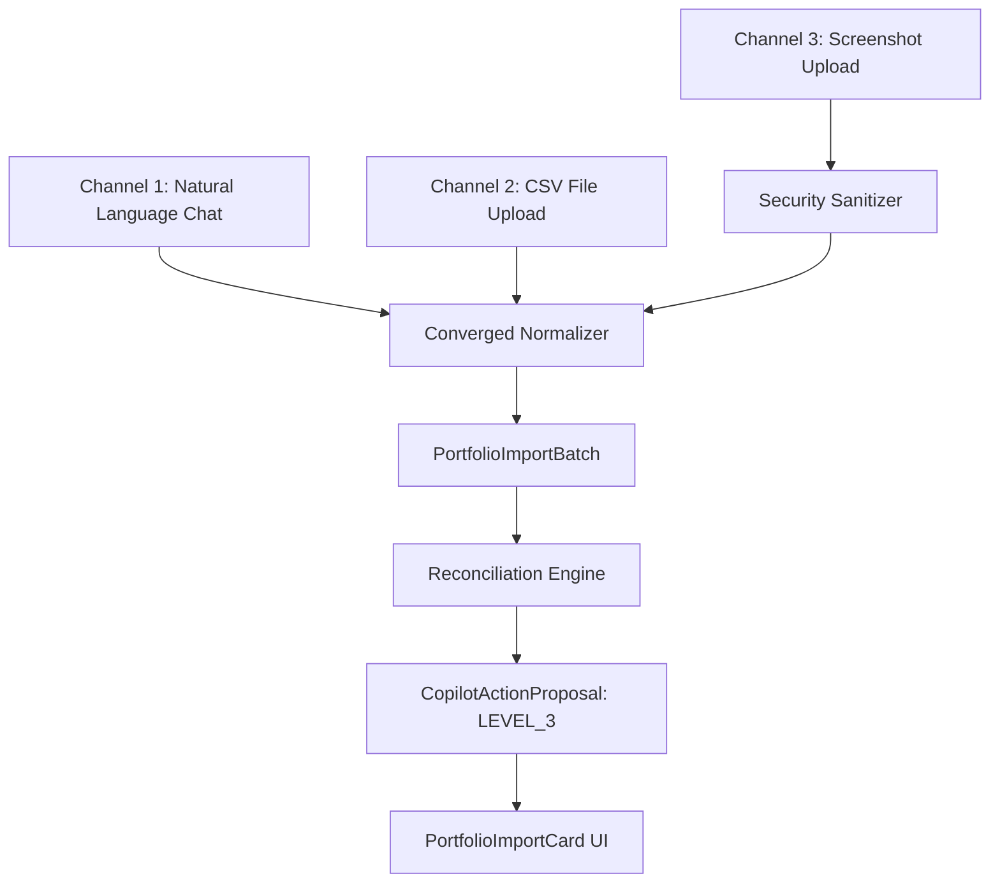
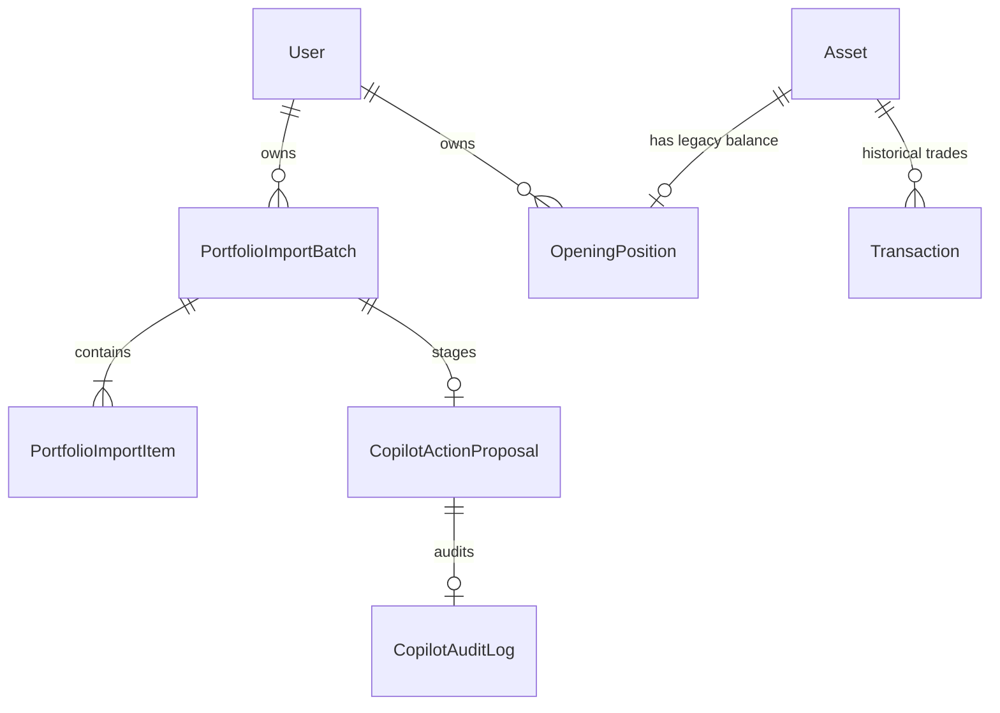

# PortfolioMind Copilot — Phase 3: Portfolio Import & Opening Position Engine Architecture

**Document Status:** Approved & Implemented Specification  
**Version:** 3.0  
**Date:** 2026-09-29  

---

## 1. Executive Summary & Core Design Principles

PortfolioMind Copilot Phase 3 implements an enterprise-grade, accounting-rigorous **Portfolio Import & Opening Position Engine**. When onboarding existing portfolios, financial trackers often either force users into painful manual single-asset entry or fabricate synthetic "BUY" transactions with arbitrary dates and prices, contaminating portfolio analytics, cash balances, and historical performance.

Phase 3 establishes four non-negotiable principles:
1. **Convergence into a Single Ingestion Pipeline:** Natural language chat, CSV file uploads, and screenshot/image uploads all converge into a canonical `PortfolioImportBatch` entity.
2. **Zero Fabricated Transactions:** Opening positions represent legacy balances and are stored strictly in the dedicated `opening_positions` table. They never synthesize fake `BUY` transactions or distort cash accounts (`cash_outflow = 0.00`).
3. **Financial Accounting Integrity:** An unknown cost basis (`cost_basis_known=False`) yields `unrealized_pl = 0.00`. Cost basis is never defaulted to zero (which would falsely show 10,000% gains) or defaulted to current market value without explicit user disclosure.
4. **Level 3 Strong Confirmation & Reconciliation:** Conflicting holdings with existing assets are flagged with friction (`NEEDS_REVIEW` / `AMBIGUOUS`). Mutations require explicit typed confirmation (`confirmation_text == "IMPORT"`), execute atomically, and produce durable audit records.

---

## 2. Converged Multi-Channel Ingestion Pipeline

### Channel 1: Natural Language Ingestion
- **Parser:** `NaturalLanguagePortfolioParser` (`backend/app/services/copilot/import_parsers/natural_language.py`)
- **Capabilities:**
  - Extracts multi-holding portfolios in Turkish and English (*"Mevcut portföyümde 20 adet AAPL, 0.5 BTC ve 10 gram altın var"*).
  - Distinguishes physical quantity from total valuation (*"1000 TL'lik altın"* vs *"10 gram altın"*).
  - Associates separated cost basis clauses (*"Maliyetlerim AAPL için 180 USD, BTC için 60000 USD"*).
  - Detects assets stated without quantity (*"Microsoft hisselerim"*), flagging `missing_fields=["quantity"]` for multi-turn completion.
  - Automatically merges conversational duplicates and excludes conversational action references (*"add it next to my existing half-gold holding"*).

### Channel 2: CSV File Upload
- **Parser:** `CsvPortfolioParser` (`backend/app/services/copilot/import_parsers/csv_parser.py`)
- **Capabilities:**
  - Auto-detects delimiters (comma `,`, semicolon `;`, tab `\t`).
  - Normalizes European and Turkish comma decimals (`1.234,56` and `285,50`).
  - Normalizes multilingual headers (`sembol`, `hisse`, `miktar`, `adet`, `maliyet`, `alis_fiyati`).
  - Flags ambiguous generic headers (`"Maliyet"`) as `missing_fields=["cost_basis_type"]` to prompt the user whether it represents unit cost or total purchase cost.

### Channel 3: Screenshot & Image Ingestion
- **Parser & Extraction Engine:** `ImagePortfolioParser` (`backend/app/services/copilot/import_parsers/image_parser.py`)
- **Current Runtime Status (Truthful Verification):**
  - **Binary & Security Validation (Active):** Enforces a strict 10MB file size limit and inspects magic byte headers for valid image signatures (PNG `\x89PNG\r\n\x1a\n`, JPEG `\xff\xd8\xff`, WEBP `RIFF....WEBP`). Corrupt or oversized images are rejected immediately with HTTP 400.
  - **Live Vision OCR Provider (Unconfigured):** No external multimodal vision OCR API (e.g., Gemini 1.5 Pro / GPT-4o Vision) is currently wired to raw pixel uploads in this environment.
  - **Safe Non-Faking Endpoint Behavior:** The upload endpoint `POST /api/copilot/conversations/{id}/import/upload` does NOT hallucinate or return fake/stub extracted data. Instead, it explicitly raises `HTTPException(status_code=501, detail="Screenshot extraction provider is not configured. Please use CSV or natural-language import.")`.
  - **Structured Vision Parser & Reconciliation Ready:** The downstream parsing engine (`ImagePortfolioParser.parse_extracted_payload`) is fully wired and tested to accept multimodal extraction payloads. It maps financial semantics (`QUANTITY`, `TOTAL_MARKET_VALUE`, `AVERAGE_COST`), enforces strict non-invention of missing fields (leaving obscured fields as `None` and tagging `missing_fields`), sanitizes prompt injection (`[BLOCKED_INSTRUCTION]`) across symbols, names, and notes, and converges cleanly into `PortfolioImportService.process_import(source_type=SCREENSHOT)`.
  - **Zero Pre-Confirmation Writes:** Verified end-to-end via deterministic controlled screenshot fixtures; no assets or opening positions are persisted until multi-turn missing items are resolved and Level 3 Strong Confirmation (`"IMPORT"`) is executed.

---

## 3. Data Models & Entity Relationships

### 3.1 `OpeningPosition` (`app/models/opening_position.py`)
- `id` (UUID, Primary Key)
- `asset_id` (UUID, Foreign Key to `assets.id`, Unique, Cascade Delete)
- `user_id` (UUID, Foreign Key to `users.id`, Indexed)
- `quantity` (`DECIMAL(18, 6)`, Non-nullable)
- `average_cost` (`DECIMAL(18, 6)`, Nullable)
- `cost_basis_known` (Boolean, Default True)
- `has_incomplete_history` (Boolean, Default True)
- `notes` (String, Nullable)
- `opened_at` (Date, Defaults to current date)
- `created_at` / `updated_at` (Timestamptz)

### 3.2 `PortfolioImportBatch` & `PortfolioImportItem` (`app/models/portfolio_import.py`)
- **Batch Statuses:** `DRAFT`, `READY_FOR_CONFIRMATION`, `APPLIED`, `CANCELLED`, `FAILED`.
- **Item Intended Actions:**
  - `CREATE_OPENING_POSITION`: New asset and opening position created.
  - `UPDATE_EXISTING_OPENING_POSITION`: Updates existing opening position balance.
  - `ADD_TO_EXISTING_OPENING_POSITION`: Adds imported quantity to existing balance.
  - `SKIP`: Excluded from import execution.
  - `NEEDS_REVIEW` / `AMBIGUOUS`: Quarantined until user makes an explicit choice.
  - `INVALID`: Parsing failure or invalid data.

---

## 4. Accounting & Portfolio Stats Integration

### 4.1 Running Quantity Derivation
In `backend/app/services/portfolio_stats.py`:
$$\text{Total Quantity} = \text{OpeningPosition.quantity} + \sum \text{BUY Quantities} - \sum \text{SELL Quantities}$$

### 4.2 Unrealized P/L Calculation
- **When Cost Basis is Known (`cost_basis_known == True` and `average_cost > 0`):**
  $$\text{Total Cost} = (\text{OpeningPosition.quantity} \times \text{OpeningPosition.average\_cost}) + \sum \text{BUY Amounts}$$
  $$\text{Unrealized P/L} = \text{Current Value} - \text{Total Cost}$$
- **When Cost Basis is Unknown (`cost_basis_known == False`):**
  $$\text{Unrealized P/L} = \$0.00 \quad (0.00\%)$$
  *Guarantees zero fake gains or inflated portfolio dashboard returns.*

### 4.3 Transaction Validation
`backend/app/services/transaction.py` checks non-negative holdings starting from `initial_qty = OpeningPosition.quantity`. Users can immediately sell shares from their imported opening position without transaction backfill errors.

---

## 5. Reconciliation & Friction Engine

When imported items match existing assets owned by the user:

| Existing Asset | Imported Item | Reconciled Intended Action | Friction Level |
| :--- | :--- | :--- | :--- |
| None | Valid Asset & Qty | `CREATE_OPENING_POSITION` | Auto-approved |
| Exists (Qty: 5) | Same Asset (Qty: 5) | `SKIP` (Already held) | Auto-resolved |
| Exists (Qty: 5) | Same Asset (Qty: 8) | `NEEDS_REVIEW` / `AMBIGUOUS` | **Friction: User must choose** |

User Resolution Choices:
1. **`REPLACE`:** Replace existing opening balance with imported quantity (e.g. update from 5 to 8).
2. **`ADD`:** Sum imported quantity with existing balance (e.g. 5 + 8 = 13).
3. **`SKIP`:** Keep existing holding unchanged, discard imported item.

---

## 6. Execution, Idempotency & Audit Trail

All writes route through `CopilotWriteExecutor._execute_portfolio_import`:
1. **Pre-commit Revalidation:** Ensures all items in batch are either resolved or skipped. Rejects if any `AMBIGUOUS` or `NEEDS_REVIEW` items remain.
2. **Level 3 Strong Confirmation:** Validates `confirmation_text == "IMPORT"`.
3. **Atomic Execution:** In a single database transaction, creates missing `Asset` records and inserts/updates `OpeningPosition` rows.
4. **Strict Idempotency:** If a proposal is already `APPLIED`, double-clicking confirm returns the cached result without duplicate insertions.
5. **Durable Audit Trail:** Inserts an immutable `CopilotAuditLog` capturing before-and-after states, batch ID, and user intent.

---

## 7. Frontend Integration

- **Import Card Component:** `frontend/src/components/copilot/PortfolioImportCard.tsx`
  - Visual status badges (`Onay Bekliyor`, `Taslak / İnceleme Gerekli`, `Uygulandı`).
  - Items summary table with current holdings, imported values, and action badges.
  - Inline resolution controls (`Replace`, `Add`, `Skip`, edit quantity/cost).
  - Confirmation button enabled only when all pending issues are cleared.
- **Upload Integration:** `frontend/src/pages/CopilotPage.tsx`
  - Attachment button (📎) supporting CSV, PNG, JPEG, and WEBP.
  - Real-time batch resolution and toast feedback.
